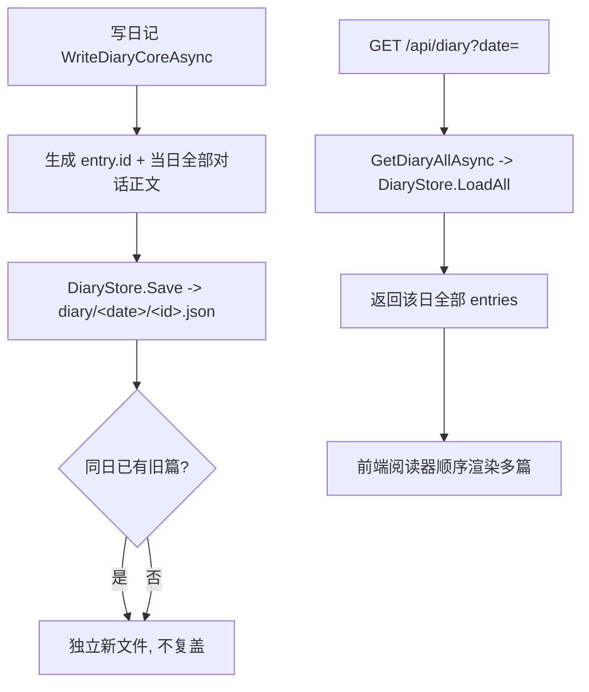

## 用户需求概述

修复 Ember 情感陪伴 Agent 日记系统的"相互覆盖" bug：当前每次写日记都会把当天已有日记覆盖掉，导致旧日记丢失。目标是让旧的日记能够和新写的日记共存（同一天可累积多篇日记）。

## 核心功能

- 日记按唯一 id 独立存储，不再覆盖同日的其他篇。
- 手动多次生成（`/diary gen`、前端"写日记"按钮）时累积多篇，而非覆盖。
- 读取指定日期返回该日全部日记（多篇），前端阅读器顺序渲染。
- 日记列表支持同日多篇并列展示。
- 向后兼容：已存在的旧格式单文件 `diary/<date>.json` 仍能被列出与阅读。
- 保留"当日首次对话后自动写一篇"的既有语义，仅改变存储与读取结构。

## 技术栈选择

- 后端：现有 VB.NET（net10.0）+ Flute HTTP 框架，无需新增依赖（沿用 DiaryStore / CompanionAgent / EmberApiController / JSON 现有模式）。
- 前端：现有原生 HTML/CSS/JavaScript 物理文件（由 Flute 直接挂载，无需重编译）。
- 存储：文件系统，按 `diary/<date>/<id>.json` 每篇独立文件。

## 实现方案

### 总体策略

保持"每次基于当日全部对话生成一篇日记"的生成逻辑不变，仅将存储模型从"每天单文件覆盖写"改为"按唯一 id 的独立文件累积写"，并相应调整读取/列表/API/前端渲染，使其支持同日多篇共存。旧的单文件日记通过兼容读取迁移为一篇。

### 关键技术决策

1. **存储结构改为 `diary/<date>/<id>.json`**：`DiaryEntry` 新增 `id` 字段（用 `yyyyMMddHHmmssfff` 时间戳字符串，稳定且可读）；`Save` 以 id 写入独立文件，绝不覆盖其他篇；`Load(date, id)` 读单篇，`LoadAll(date)` 返回该日全部，`ListAll()` 遍历 `diary/` 下所有 `<date>/<id>.json`（含读旧单文件兼容）。
2. **向后兼容旧单文件**：`ListAll`/`Load` 遇到旧 `diary/<date>.json` 时，用 `date` 派生一个稳定 id（如 `legacy-<date>`）作为该篇 id；首次新写不会触碰旧文件。
3. **读取语义分层**：`GetDiaryAsync(date)` 返回该日**最新一篇**（保持"今日查看/REPL 默认展示"语义）；新增 `GetDiaryAllAsync(date)` 返回该日全部，供 API 与前端阅读器使用。
4. **API 调整**：`GET /api/diary?date=` 响应 `DiaryResult` 新增 `entries As List(Of DiaryEntry)`（该日全部）；保留原有 `date/title/content/generatedAt` 字段（赋值为最新一篇），兼容未升级的前端/REPL。`GET /api/diary/list`、`POST /api/diary/generate` 基本不变（`DiaryListResult` 已支持多条目；`DiaryGenerateResult` 返回新写篇 `date`+`id`）。
5. **前端渲染多篇**：`loadDiaryContent(date)` 接收该日全部 `entries` 并顺序拼接（每篇标题+元信息+正文，加分隔）；`loadDiaryCard` 展示最新一篇并可提示"今日 N 篇"；`loadDiaryList` 同日多篇均列出（已支持多条目，仅确保聚合正确）。
6. **性能/可靠性**：`ListAll` 仅遍历一次目录，O(n) 文件读取；旧单文件兼容读取放在 try/catch 内，损坏文件跳过不中断；所有改动沿用既有异常容错风格（Console.Error + 安全返回）。

### 实现注意事项

- `WriteDiaryCoreAsync` 生成 `entry.id` 后调用 `DiaryStore.Save`，不改变其对话素材来源（`_todayStartIndex` 起的全部消息）。
- `_lastAutoDiaryDate` 自动写一次逻辑保持不变；手动多次写现在累积而非覆盖。
- `DiaryEntry.id` 序列化需在 `GetJson(simpleDict:=True)` 下兼容（作为普通字符串字段）。
- REPL `/diary show <date>` 改为循环展示该日全部篇。

## 架构设计

### 数据流（多日记共存）



## 目录结构与文件改动

```
src/Ember/
├── Diary/
│   └── DiaryStore.vb          # [MODIFY] DiaryEntry 新增 id；Save 按 id 独立文件；新增 Load(date,id)、LoadAll(date)；ListAll 兼容旧单文件与遍历 <date>/<id>.json。
├── CompanionAgent.vb          # [MODIFY] WriteDiaryCoreAsync 生成 entry.id；新增 GetDiaryAllAsync(date)；GetDiaryAsync 返回最新一篇。
├── Web/
│   ├── EmberApiController.vb   # [MODIFY] GET /api/diary 返回该日全部 entries；generate 返回 id。
│   └── JSON.vb                 # [MODIFY] DiaryResult 新增 entries 字段。
├── Application/
│   └── Repl.vb                 # [MODIFY] /diary show 循环展示该日全部篇。
agent/web/
├── resource/javascript/app.js  # [MODIFY] loadDiaryContent 渲染多篇；loadDiaryCard 提示篇数；loadDiaryList 聚合正确。
└── resource/styles/style.css   # [MODIFY] 多篇分隔样式（可选微调）。
```

## 关键代码结构（接口级）

```
' DiaryEntry 新增
Public Property id As String = ""

' DiaryStore 新增/调整
Public Function Save(diaryDir As String, entry As DiaryEntry) As Boolean   ' 按 entry.id 写入 diary/<date>/<id>.json
Public Function Load(diaryDir As String, [date] As String, id As String) As DiaryEntry
Public Function LoadAll(diaryDir As String, [date] As String) As List(Of DiaryEntry)
Public Function ListAll(diaryDir As String) As List(Of DiaryEntry)         ' 遍历 <date>/<id>.json + 兼容旧 <date>.json

' CompanionAgent 新增
Public Async Function GetDiaryAllAsync(Optional [date] As String = Nothing) As Task(Of List(Of DiaryEntry))

' JSON DiaryResult 新增
Public Property entries As New List(Of DiaryEntry)
```