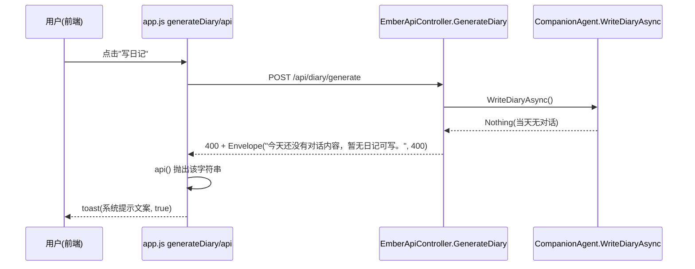

## 用户需求概述

优化日记生成在无对话场景下的前端错误提示：调用 `/api/diary/generate` 时若当天没有对话内容，前端应从笼统的"请求失败"通用错误，改为显示后端系统提示"今天还没有对话内容，暂无日记可写。"，避免用户误以为后台异常。

## 核心功能

- 后端在无对话（生成结果为 Nothing）时，返回携带明确中文文案的字符串错误响应（HTTP 400）。
- 前端 `generateDiary` 的错误处理直接展示后端返回的系统提示文案，而非"请求失败"通用文案。
- 仅影响"无对话导致生成失败"这一正常业务分支；真正的服务端异常（500）仍按原样暴露异常消息。
- 保持与 `CompanionAgent.WriteDiaryCoreAsync` 中控制台打印文案"[系统] 今天还没有对话内容，暂无日记可写。" 的措辞一致。

## 技术栈选择

- 后端：现有 VB.NET（net10.0）+ Flute HTTP 框架，沿用现有 `Envelope`/`Fail` 字符串 info 模式，无新增依赖。
- 前端：现有原生 JavaScript（物理文件，由 Flute 直接挂载，无需重编译程序集）。

## 实现方案

### 总体策略

利用现有 `Envelope(stringMessage, code)` 的重载（已在 `RequireValidToken`、`Fail` 等处使用）：后端将"无对话"这一业务失败以**字符串 info** 形式返回 HTTP 400；前端 `api()` 现有逻辑已支持 `typeof data.info === "string"` 分支，可把该字符串作为错误 `message` 抛出，使 `generateDiary` 的 `catch` 原样展示系统提示。

### 关键技术决策

1. **后端改为字符串 info**：原 `Envelope(New DiaryGenerateResult With {.ok=False,...}, 400)` 的 `data.info` 是对象，前端 `api()` 无法取到可读文案而回退为"请求失败"。改为 `Envelope("[系统] 今天还没有对话内容，暂无日记可写。", 400)`，使 `data.info` 为字符串 → 前端 `api()` 抛出该字符串。
2. **前端 catch 直接透传文案**：当前 `toast(`日记生成失败：${e.message}`, true)` 会在系统提示前拼接"日记生成失败："，虽可读但与用户期望的"直接显示系统提示"略有出入。改为 `toast(e.message, true)`，原样展示后端系统提示（含"[系统]"前缀），与用户期望措辞完全一致。
3. **错误分类保留**：500 异常仍由 `Fail(response, ex)` 返回 `Envelope(ex.Message, 500)`，前端照常显示异常消息，不影响真实故障排查。
4. **改动范围最小化**：仅改 `GenerateDiary` 的"无对话"分支与前端 `catch` 一行，不动正常生成/读取/列表逻辑，向后兼容。

### 实现注意事项

- 文案与 `CompanionAgent.vb` 行 423 控制台输出完全一致：`[系统] 今天还没有对话内容，暂无日记可写。`
- `DiaryGenerateResult` 仍用于成功（`ok=true`）与无对话以外的失败场景，结构体无需删除。
- 前端 `else`（r.ok）分支当前不可达（400 时 api() 已抛错），保留无害；本计划不强制清理，降低改动面。

## 架构设计



## 目录结构与文件改动

```
src/Ember/
└── Web/
    └── EmberApiController.vb   # [MODIFY] GenerateDiary 中 entry Is Nothing 分支：将对象 info 改为字符串 info Envelope("...暂无日记可写。", 400)

agent/web/
└── resource/javascript/app.js  # [MODIFY] generateDiary 的 catch 分支：toast(e.message, true) 直接透传后端系统提示
```

## 关键代码结构

```
' EmberApiController.GenerateDiary（无对话分支示意）
If entry Is Nothing Then
    Call response.WriteJSON(Envelope("[系统] 今天还没有对话内容，暂无日记可写。", 400))
End If
```