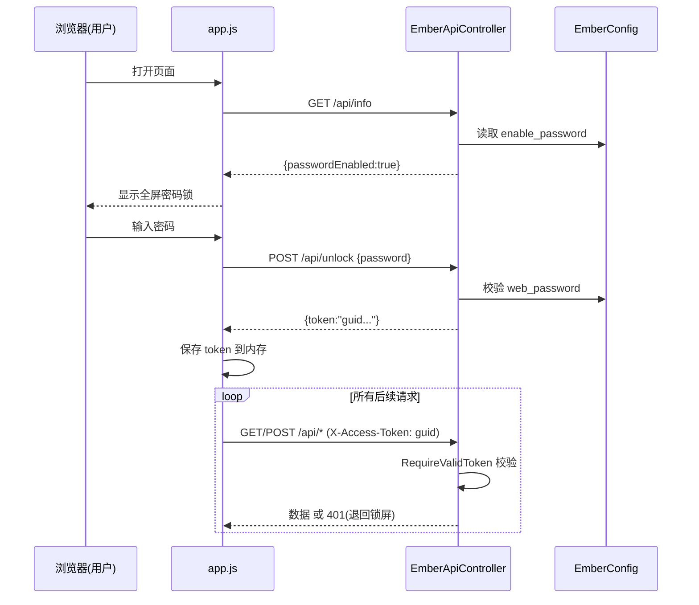

## 用户需求概述

为 Ember 情感陪伴 Agent 的 HTTP 服务模式增加**可选的 Web 前端密码锁**，使其能安全地部署到公网。

## 核心功能

- **后台可选开关**：在 `settings.ini` 的 `[web]` 段新增 `enable_password`（开关）与 `web_password`（密码）配置；关闭时前端行为完全不变（向后兼容）。
- **前端锁屏界面**：当后台启用密码安全后，Web 前端首屏显示全屏密码锁界面，遮挡聊天主界面，用户必须输入正确密码才能进入。
- **会话令牌校验**：前端启动先查询后端是否启用密码；用户输入密码提交后端校验（后端不回传明文）；校验成功返回一次性 session token，前端持有并在之后所有 `/api/*` 请求中自动携带。
- **全接口保护**：解锁前前端不请求任何 agent 数据；解锁后后端对所有 `/api/*` 端点统一校验 token；token 校验失败（401）时前端自动退回锁屏。
- **远程关闭不受影响**：Flute 内置的 `OPTIONS /ctrl/kill`（由 shutdown_token 控制）不受密码锁阻断，确保服务仍可被安全关闭。

## 技术栈选择

- 后端：现有 VB.NET（net10.0）+ Flute HTTP 框架 + GCModeller sciBASIC#，无需新增依赖。
- 前端：现有原生 HTML/CSS/JavaScript（物理文件，由 Flute 直接挂载，无需重新编译程序集）。
- 鉴权机制：后端进程内 session token（内存字典，重启即失效），前端通过 `X-Access-Token` 请求头携带。

## 实现方案

### 总体策略

沿用现有 Flute 控制器的反射注册模式与 `settings.ini` 配置体系。后端在 `EmberApiController` 中新增两个端点（`GET /api/info`、`POST /api/unlock`）与统一 token 校验逻辑；前端在 `api()` 统一入口附加 token 头并将锁屏逻辑插入 `init()` 启动链。token 采用进程内 GUID 字典，避免明文/哈希暴露，符合"不回传密码"的安全要求。

### 关键技术决策与权衡

1. **token 存于进程内内存字典**（`Dictionary(Of String, Boolean)` 或 `(token, expireAt)`）：简单、零持久化、重启即失效；对于单实例本地 Agent 服务足够且避免磁盘落盘密码风险。若需多实例需外部存储，但本项目为单进程常驻，内存方案最优。
2. **所有 `/api/*` 走统一校验函数** `RequireValidToken(request, response)`：在每个 handler 入口（紧跟 `AllowCors` 之后）调用，避免逐个重复；`/api/info` 与 `/api/unlock` 本身免校验（unlock 正是换取 token 的入口）。`/ctrl/kill` 由 Flute 内置不受此层影响。
3. **前端 `api()` 单一出口加头**：`getJSON`/`postJSON` 均经 `api()`，在此统一附加 `X-Access-Token`（来自内存变量/降级 localStorage），401 时触发 `showLockScreen()`，避免散落改动。
4. **配置下沉到控制器**：扩展 `EmberApiController` 构造函数与 `EmberWebServer`、传入 `EmberConfig`（或显式密码字段），使控制器能读取 `enable_password`/`web_password` 并生成校验 token。保持与现有 `New EmberApiController(_agent)` 风格一致，仅增加参数。

### 性能与可靠性

- token 校验为 O(1) 字典查找，无性能瓶颈；高频 `/api/chat/live` 轮询每次仅多一次字典查询。
- 所有 handler 已有全局异常捕获，新增校验逻辑置于 `Try` 内，校验失败直接 `response.WriteJSON(Envelope(...,401))` 返回，绝不崩溃 worker 线程。
- 密码比较使用 `String.Equals(..., Ordinal)` 常量时间思路（简单相等比较，避免异常）。

### 安全说明（写入代码注释）

纯 HTTP 下 token 仍可能被网络嗅探；建议在公网部署时前置 HTTPS 反向代理（Nginx/Caddy）。`/api/info` 仅返回布尔 `passwordEnabled`，绝不返回密码或哈希。

## 实现注意事项

- 向后兼容：`enable_password=false`（默认）时，后端 `/api/info` 返回 `passwordEnabled:false`，前端跳过锁屏，所有现有行为不变；旧用户无感升级。
- 启动日志：在 `RunHttpService` 增加类似 `shutdown_token` 的提示（行 40-44 位置），告知密码锁状态。
- 静态文件无需重编译：前端改动直接编辑 `agent/web/` 物理文件即生效。

## 架构设计



## 目录结构与文件改动

```
src/Ember/
├── Config/
│   └── EmberConfig.vb          # [MODIFY] 新增 enable_password(bool)、web_password(string) 属性；
│                               #           在 ReadFromIni() 读取、WriteDefaultIni() 写入默认注释；
│                               #           数值/字符串合法性保护处补 trim。
├── Web/
│   ├── EmberApiController.vb   # [MODIFY] 构造函数增加 config 参数；新增 GET /api/info、
│                               #           POST /api/unlock；新增进程内 token 字典与
│                               #           RequireValidToken 统一校验；各 /api/* handler 入口调用校验。
│   ├── EmberWebServer.vb       # [MODIFY] New() 与 Start() 将 EmberConfig 传入控制器。
│   └── JSON.vb                 # [MODIFY] 新增 InfoResult、UnlockResult DTO。
├── Application/
│   └── Http.vb                 # [MODIFY] 构造 EmberWebServer 时传入 config；启动日志提示密码锁状态。

agent/web/
├── index.html                  # [MODIFY] 在 #app 之后新增全屏密码锁覆盖层（标题/密码框/解锁按钮/错误提示）。
└── resource/
    ├── javascript/app.js       # [MODIFY] els 增加锁屏引用；api() 统一附加 token 头与 401 处理；
    │                           #           init() 前置 checkLock()；新增 showLock/submitUnlock 逻辑。
    └── styles/style.css        # [MODIFY] 新增锁屏覆盖层样式（全屏居中卡片、输入框、按钮、主题协调）。
```

## 关键代码结构（接口级）

```
' EmberApiController 新增构造函数签名与端点（示意，非实现体）
Public Sub New(agent As CompanionAgent, config As EmberConfig)

<HttpGet("/api/info")>
Public Sub GetInfo(request As HttpRequest, response As HttpResponse)
' 免 token 校验；返回 InfoResult{passwordEnabled As Boolean, model As String, ...}

<HttpPost("/api/unlock")>
Public Sub Unlock(request As HttpRequest, response As HttpResponse)
' 免 token 校验；读取 body.password 与 config.web_password 比较；
' 成功生成 GUID token 存入内存字典，返回 UnlockResult{token As String}；失败返回 401。

Private Function RequireValidToken(request As HttpRequest, response As HttpResponse) As Boolean
' 读取 X-Access-Token 头，字典校验；失败写 401 并返回 False。
```

## 设计风格

采用与现有 `index.html` 一致的温暖、柔和、情感陪伴风格（珊瑚橙主题变量），不引入新框架，直接复用 `style.css` 中已有的主题 CSS 变量（如 `--accent`、`--bg` 等）。

## 锁屏界面设计（单屏覆盖层）

- **布局**：全屏固定定位（`position:fixed; inset:0`），半透明毛玻璃遮罩（`backdrop-filter: blur`），居中显示锁屏卡片。
- **卡片内容（自上而下）**：

1. 🔥 头像 emoji + "Ember" 标题与副标题"需要密码才能进入"。
2. 密码输入框（type=password，圆角、聚焦发光边框，与现有 modal-input 风格一致）。
3. 解锁按钮（主色填充，hover 微动效，文案"进入"）。
4. 错误提示行（默认隐藏，密码错误时显示红色"密码不正确，请重试"）。

- **交互**：回车提交；错误时输入框轻微抖动动画；解锁成功后整层 `fadeOut` 淡出移除，露出聊天界面。
- **响应式**：移动端与桌面端均居中自适应，卡片最大宽度约 360px。