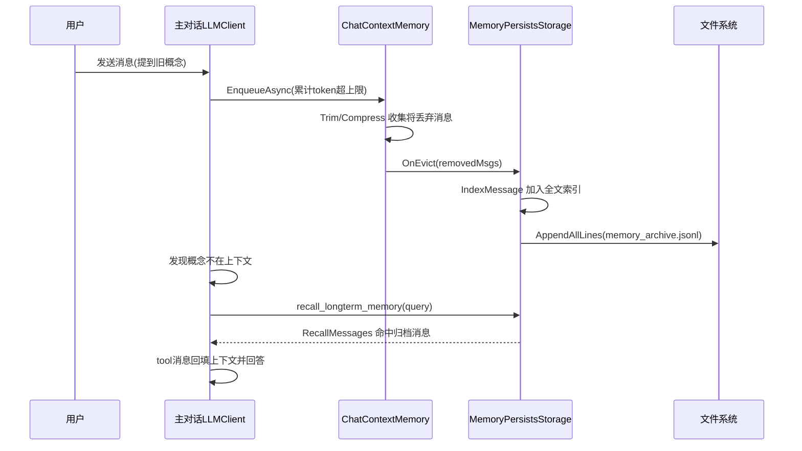

## 用户需求概述

当前 LLM 情感陪伴 Agent 的记忆系统在会话 token 达到上限后，会直接丢弃最早的对话消息，且这些被丢弃的消息未被保存，导致 LLM 无法"回忆"起被遗忘的概念，长期记忆形同虚设。需要优化记忆系统，使被裁剪的对话能被持久化并建立全文索引，供 LLM 通过一个 function tool 随时找回。

## 核心功能

- 独立长期记忆存储：所有被裁剪（减裁）丢弃的对话内容写入独立的 jsonl 文件（如 memory_archive.jsonl），与当前活跃窗口的 chat_history.json 分离；程序重启后可从 jsonl 重建长期记忆索引。
- 裁剪归档钩子：ChatContextMemory 在触发裁剪/压缩并准备丢弃消息前，将即将被丢弃的消息通过回调交给 MemoryPersistsStorage 归档。
- 全文索引覆盖长期记忆：MemoryPersistsStorage 在保存与加载时，把归档消息一并加入 QGramFullText 全文索引，使 RecallMessages / Search 能找回被裁剪的记忆（活跃窗口 + 归档消息共同构成可检索记忆）。
- 长期记忆检索 function tool：为对话主客户端注册 recall_longterm_memory 工具，由 LLM 自主判断用户提到的概念不在当前上下文时调用，从长期记忆中模糊召回相关对话，结果作为 tool 消息回填上下文，LLM 据此连贯回答；找不到时再凭自身理解回答。
- chat_history.json 仍只保存当前活跃会话窗口，保持向后兼容；未配置归档路径（非 Ember 场景）时行为不变。

## 技术栈选择

- 后端：现有 VB.NET（net10.0）+ Flute HTTP 框架 + Ollama/OpenAI LLM Provider，沿用 LLM 库（`Ollama` 项目）既有 `ChatContextMemory` / `MemoryPersistsStorage` / `FunctionTool` / `FunctionCaller` 体系，无新增第三方依赖。
- 前端：本次改动不涉及 Web 前端 UI（纯后端记忆/工具链路），无需前端改动。
- 存储：活跃窗口 JSON（`chat_history.json`，既有）；长期记忆 JSONL（`memory_archive.jsonl`，新增，追加写）。

## 实现方案

### 总体策略

在裁剪链路中插入"归档"环节：给 `ChatContextMemory` 增加一个 `OnEvict` 回调，在 `Trim()` / `CompressAsync()` 真正丢弃消息前触发，把将丢弃的消息交给外部；`MemoryPersistsStorage` 持有归档消息列表，负责把归档消息写入独立的 jsonl 文件并加入全文索引（与活跃窗口共享同一索引）。Ember 侧把 `Context.OnEvict` 挂到存储的 `AddArchived`，并为主对话客户端注册 `recall_longterm_memory` 工具，工具执行体调用既有 `RecallMessages`。

### 关键技术决策与权衡

1. **OnEvict 回调（ChatContextMemory）**

- 新增 `Public Property OnEvict As Action(Of List(Of ChatMessage))`。
- 在 `Trim()` 中，移除循环内把"将被丢弃的组"先收集到临时列表，循环结束后若有 `OnEvict` 则 `OnEvict(removedList)` 再 `RebuildQueueFromGroups`。
- 在 `CompressAsync()` 中复用已收集的 `allRemovedMessages`，在移除后调用 `OnEvict(allRemovedMessages)`（注意 `allRemovedMessages` 当前仅在 `allRemovedMessages.Count > 0` 分支内逻辑使用，需在 `End Try` 前统一回调一次）。
- 决策理由：最小侵入、向后兼容（未赋值则无行为）；避免直接耦合 `MemoryPersistsStorage`，符合 SoC。

2. **MemoryPersistsStorage 归档通道（核心）**

- 构造函数扩展：`Sub New(memory, Optional filePath As String = Nothing, Optional archivePath As String = Nothing)`。保持原两个参数签名兼容（Ember 之外旧调用不传 archivePath）。
- 新增 `ReadOnly _archivePath As String`。新增内部 `_archived As New List(Of ChatMessage)`（内存中已归档消息，用于 Save 时落盘全部归档）。
- 新增方法：
    - `Public Sub AddArchived(msgs As IEnumerable(Of ChatMessage))`：增量把消息加入 `_archived` 与全文索引（`IndexMessage`），并**追加**写入 jsonl（`File.AppendAllLines`，每行一条 `msg.GetJson(simpleDict:=True)`）。仅追加新增，避免每次序列化全量，性能友好。
    - `Public Sub LoadArchive()`：若 `_archivePath` 存在，按行读 jsonl，`LoadJsonFile(Of ChatMessage)` 逐条反序列化并 `IndexMessage`（只进索引，不进活跃队列）。文件损坏行跳过并记日志。
    - `Save()` 增强：在写 `_filePath`（活跃窗口）后，若 `_archivePath` 非空，把当前 `_archived` 全量写回 jsonl（保证与内存一致；采用整体重写归档文件，归档量远小于活跃窗口频繁写入，可接受；或维持追加+去重——鉴于 Save 可能多次调用导致重复追加，采用"Save 时整体重写 `_archived`"更稳妥，避免重复行）。
- 决策理由：索引同时覆盖活跃窗口 + 归档，使 `RecallMessages`/`Search` 能找回被裁剪记忆；`AddArchived` 在每次裁剪发生时即时落盘，进程崩溃也不丢长期记忆。

3. **EmberConfig 新增路径**

- 新增 `Public ReadOnly Property MemoryArchiveFilePath As String` = `Path.Combine(DataDirectory, "memory_archive.jsonl")`，与 `ChatHistoryFilePath` 同构。

4. **CompanionAgent 装配（核心接线）**

- `New(...)` 中构造存储改为：`_storage = New MemoryPersistsStorage(mainClient.Context, config.ChatHistoryFilePath, config.MemoryArchiveFilePath)`；`_storage.Load()` 后追加 `_storage.LoadArchive()`。
- 挂接裁剪归档：`mainClient.Context.OnEvict = AddressOf _storage.AddArchived`（在 Context 创建后即可、Load 之后设置均可，建议在构造 storage 后设置）。
- 注册工具：`mainClient.AddFunction(recallFunc, AddressOf RecallToolHandler)`，其中 `recallFunc = New FunctionModel("recall_longterm_memory", "当用户提到的概念/人物/事件不在当前对话上下文中、需要回忆更早的聊天记忆时调用。输入用户提到的关键词/短语，返回相关的历史对话片段。", New ParameterProperties("query", "用户提到的、当前上下文中不存在的概念、人名、事件或关键词"))`。
- 新增 `Private Function RecallToolHandler(fc As FunctionCall) As String`：解析 `fc.arguments("query")` → `Dim hits = _storage.RecallMessages({query}, top:=RECALL_TOOL_TOP).ToArray()` → 格式化为可读文本（role + content 截断），无命中返回"未找到相关记忆"。该方法只读存储索引，需在 `_gate` 内调用（Ember 的 Chat 调用已在 `_gate` 串行，工具执行发生在 Chat 内部轮次，天然受 `_gate` 保护；为稳妥可加 `SyncLock` 或复用 `_gate`，但 `_gate` 不可重入，故用独立轻量 `SyncLock _storage` 或只读不加锁——索引为只读查询，AppendAllLines 与查询并发风险低，采用在方法内对存储加同步锁保护）。
- 决策理由：仅给 `mainClient` 注册（sumClient 为一次性画像总结，preserveMemory:=False，不应具备记忆检索工具）；LLM 自主判断调用，符合用户选择。

5. **对话工具调用回填（已具备）**

- `LLMClient.ChatRound` 已实现标准 function-calling：assistant tool_calls → `ExecuteTool` → tool 消息回填上下文（L363-375）。`recall_longterm_memory` 返回结果作为 tool 消息注入，LLM 据此继续回答，符合用户"作为 tool 消息注入上下文"的选择。

### 实现注意事项

- **向后兼容**：MemoryPersistsStorage 旧两参构造、未传 archivePath 时 `_archivePath` 为空，`AddArchived`/`LoadArchive`/`Save` 的归档分支全部短路，行为完全等同原实现；`OnEvict` 未赋值则无副作用。
- **索引去重**：`_documents` 按文档文本去重，归档消息与活跃窗口重复同一句话安全；同一消息多次归档（罕见）因 jsonl 整体重写也仅保留一份 `_archived`，索引不会重复膨胀。
- **性能**：裁剪触发频率低（仅达 token 上限时），`OnEvict` 即时追加 jsonl 开销可忽略；`RecallMessages` 为内存 QGram 查询，O(1) 级词表查找，延迟极低，不影响对话实时性。
- **数据正确性**：归档消息保持原始 `ChatMessage`（含 role/content/tool_calls），索引 `ToDocument` 同活跃窗口逻辑；jsonl 逐行 `simpleDict:=True` 与既有 `context_log.jsonl` 风格一致，便于排查。
- **错误处理**：`AddArchived`/`LoadArchive` 写入与读取异常捕获并记 `Console.Error`，不向上抛，避免中断主对话；单行损坏跳过，保证其余归档可用。
- **日志**：复用既有 `Console.WriteLine("[MemoryPersistsStorage] ...")` 风格输出归档条数与加载结果，便于运维观测长期记忆规模。

## 架构设计



## 目录结构与文件改动

```
G:/LLMs/src/Ollama/ContextMemory/ChatContextMemory.vb   # [MODIFY] 新增 OnEvict 回调属性；Trim/CompressAsync 在丢弃消息前调用 OnEvict 传递将丢弃消息列表
G:/LLMs/src/Ollama/ContextMemory/MemoryPersistsStorage.vb  # [MODIFY] 构造函数增加 archivePath 参数；新增 _archivePath/_archived；新增 AddArchived/LoadArchive；Save 增加归档落盘与索引；Load 增加 LoadArchive 调用
g:/Ember/src/Ember/Config/EmberConfig.vb                # [MODIFY] 新增 MemoryArchiveFilePath 属性(指向 DataDirectory/memory_archive.jsonl)
g:/Ember/src/Ember/CompanionAgent.vb                    # [MODIFY] 构造存储时传入 archivePath；Load 后调 LoadArchive；挂 Context.OnEvict=AddArchived；为主客户端注册 recall_longterm_memory 工具及 RecallToolHandler
```

## 关键代码结构（示意）

```
' ChatContextMemory：新增回调
Public Property OnEvict As Action(Of List(Of ChatMessage))

' MemoryPersistsStorage：扩展构造与归档方法
Public Sub New(memory As ChatContextMemory, Optional filePath As String = Nothing, Optional archivePath As String = Nothing)
Public Sub AddArchived(msgs As IEnumerable(Of ChatMessage))   ' 进索引 + 追加 jsonl
Public Sub LoadArchive()                                      ' 读 jsonl 进索引(不进活跃队列)

' CompanionAgent：工具与处理
Private Function RecallToolHandler(fc As FunctionCall) As String
```

## Agent Extensions

### SubAgent

- **code-explorer**
- Purpose: 在实现前对 LLM 库与 Ember 的记忆/工具调用链做最终的跨文件影响分析，确认 OnEvict 触发点、FunctionTool 注册链路、索引读写路径无遗漏依赖。
- Expected outcome: 输出受影响的全部文件、方法签名与调用顺序清单，确保 plan 落地无遗漏、无破坏性改动。