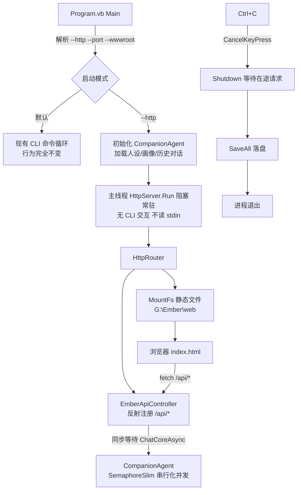

## 用户需求

为 Ember.vbproj（VB.NET net10.0，Flute.NET5 引用已由用户添加）添加 HTTP 服务运行模式，并在 G:\Ember\web 编写配套 Web 聊天界面。

## 需求修订（最高优先级）

**HTTP 模式 = 无界面后台服务**：以 `--http` 启动后，用户不能从 CLI 界面交互（不进入命令循环、不读 stdin），程序以后台服务方式常驻运行，仅通过 HTTP API 与 Web 页面提供服务。HTTP 模式与 CLI 模式互斥，一个进程只运行一种模式。

## 产品概述

- **CLI 模式（默认，无参数）**：现有命令行交互行为完全不变
- **HTTP 模式（--http）**：加载配置与持久化数据（人设/画像/对话历史）后启动 Web 服务器常驻运行，对外提供 REST API 与静态 Web 页面；Ctrl+C 优雅关闭（先停止 HTTP 服务等待在途请求，再统一落盘退出）

## 核心功能

- **互斥双模式启动**：`--http [--port N] [--wwwroot 目录]` 启动后台服务模式；无参数保持现有 CLI 行为零变化；两模式共享同一数据目录（人设/画像/对话记忆互通）
- **Web API 服务**：基于 Flute HttpRouter 反射控制器提供 REST API——对话（含思考过程）、历史消息、人设查看/设置/重置、用户画像查看/手动总结、运行状态、手动保存
- **静态 Web 界面**：MountFs 挂载 G:\Ember\web 提供 HTML+JS 聊天界面，light 主题清新活泼亮丽配色
- **Web 聊天体验**：启动加载历史消息、发消息、思考中动画、打字机式回复呈现、思考过程折叠查看、人设编辑、画像刷新、手动保存、连接状态指示
- **并发安全**：多个浏览器标签/并发 API 请求对同一智能体（对话记忆非线程安全）的访问串行化
- **配置管理**：settings.ini 新增 [web] 节（http_port 默认 8080、wwwroot 空=自动探测），命令行参数可覆盖

## 技术栈

- **语言/平台**：VB.NET net10.0（沿用现有项目；vbproj 已含 Flute.NET5 引用，无需改动）
- **HTTP 服务**：Flute 库 HttpRouter（反射注册控制器 + MountFs 静态文件）+ HttpSocket
- **前端**：原生 HTML + CSS + JavaScript 三文件（G:\Ember\web），无构建工具；style.css 通过 @import 引入 Tailwind CDN 作工具类基础，核心组件视觉以自定义 CSS 变量与规则实现（离线时核心界面仍完整可用）

## 关键 API（已验证）

- `New HttpRouter(controller)`：反射注册控制器公共方法，需 `<HttpGet("/url")>`/`<HttpPost("/url")>` 特性（位于 `Flute.Http.Core.Message.HttpHeader` 命名空间），方法签名必须为 `Sub(request As HttpRequest, response As HttpResponse)`；`.MountFs(New WebFileSystemListener(New FileSystem(wwwroot)))` 挂载静态文件（内置路径穿越防护、目录转 index.html 重定向、CORS *）
- `New HttpSocket(router As IAppHandler, port%, Optional threads%, Optional configs, Optional jsonParser)` 直接接受 router
- `HttpServer.Run()`：阻塞式 accept 循环（主线程阻塞，与后台服务常驻模型天然契合）；`Shutdown()` 优雅关闭（设 Is_active=False、停止监听、关闭 websocket/longpoll、等待在途 worker 最多 10 秒）；端口占用时 Run 返回 500；`Microsoft.VisualBasic.Net.Tcp.PortIsAvailable(port)` 可预检测
- `HttpResponse.WriteJSON(Of T)(obj)` / `WriteError(code, msg)` / `AccessControlAllowOrigin` 属性；Flute.Extensions 全局模块 `response.SuccessMsg(Of T)(msg)` / `FailureMsg(Of T)(msg, code)` 写 {code, info} 包装 JSON
- `HttpPOSTRequest`：`DirectCast(request, HttpPOSTRequest)("field").DefaultValue` 读 JSON body 字段；query 回退 `request.URL.query("name").ElementAtOrNull(Scan0)`

## 架构与数据流



## 关键决策

1. **模式互斥（本轮修订核心）**：`--http` 时不进入 CLI 循环、不读 stdin（服务化部署 stdin 可能重定向/关闭）；主线程直接调用 `HttpServer.Run()` 阻塞常驻（Flute 设计即如此，无需额外后台线程封装）；Ctrl+C 经 CancelKeyPress 事件触发 Shutdown + SaveAll，Run 循环退出后进程正常结束
2. **并发互斥**：Flute 用 ThreadPool 多线程处理请求，多浏览器标签/并发 API 会同时访问 agent，而 ChatContextMemory/LLMClient 非线程安全；VB 的 SyncLock 块内不允许 Await，故用 `SemaphoreSlim(1,1).WaitAsync()` 串行化全部读写操作（对话、人设修改、画像总结、保存）。互斥粒度为整个操作，情感陪伴场景并发低、可接受
3. **HTTP worker 同步等待异步**：worker 线程无 SynchronizationContext，handler 内 `.GetAwaiter().GetResult()` 等待 ChatCoreAsync 无死锁；POST /api/chat 返回完整 {reply, think, turn}，前端用打字机动画模拟流式（第一版不引入 LongPoll/SSE）
4. **状态快照模式**：新增 AgentStatusSnapshot/PersonaSnapshot 等结构，在互斥锁内生成快照返回，避免读状态与写对话的竞态
5. **wwwroot 三级解析**：ini [web] wwwroot 显式配置 → 命令行 --wwwroot 覆盖 → 自动探测（exe 同级 web，从 exe 目录向上逐级查找名为 web 的目录最多 6 级，开发环境自动命中 g:\Ember\web；均失败回退 exe 同级 web 并提示）
6. **端口占用处理**：启动前 `Tcp.PortIsAvailable` 预检测，占用则报错退出（HTTP 模式是显式请求，静默降级会造成困惑）；ini 默认端口 8080

## REST API 契约（统一 {code, info} 格式，code=0 成功；DataContractJsonSerializer 属性名区分大小写）

| 方法 | 路径 | 请求 | info 响应 |
| --- | --- | --- | --- |
| GET | /api/status | - | {backend, model, turns, tokens, maxTokens, personaName, personaIsDefault, profileUpdated, autosave, dataDir} |
| GET | /api/persona | - | {name, description, isDefault, updatedAt} |
| POST | /api/persona | {description} | {ok} |
| POST | /api/persona/reset | - | {ok} |
| GET | /api/profile | - | {summary, traits[], interests[], emotionalState, communicationStyle, updatedAt, isEmpty} |
| POST | /api/profile/refresh | - | {updated}（同步等待画像总结完成） |
| GET | /api/history?limit=50 | query | {messages:[{role, content}]} |
| POST | /api/chat | {message} | {reply, think, turn} |
| POST | /api/save | - | {ok} |


## 性能与可靠性

- 画像总结仅在互斥锁内的对话轮次达阈值时触发（复用现有逻辑）；/api/profile/refresh 手动触发同样走互斥锁
- HTTP 模式下 LLMClient 内部固定 Console.Write 的流式 token 输出到 stdout，作为服务运行日志（Flute 既有行为，合理）
- 所有 API handler 全 try/catch，异常走 FailureMsg 返回 code=500，绝不让 worker 线程崩溃
- 静态文件由 WebFileSystemListener 托管：小文件内存缓冲、大文件流式、路径穿越防护均为库内置
- 关闭顺序：Ctrl+C → HttpServer.Shutdown()（等待在途请求，最多 10 秒） → agent.SaveAll() → Dispose → 进程退出

## 目录结构

```
g:\Ember\src\Ember\
├── Ember.vbproj              [不变] Flute 引用用户已添加
├── Program.vb                [MODIFY] 解析 --http/--port/--wwwroot；--http 时初始化 agent 后主线程 Run 常驻（不进 CLI 循环不读 stdin），Ctrl+C 触发 Shutdown+SaveAll；默认路径保持现有 CLI 行为零变化
├── CompanionAgent.vb         [MODIFY] 新增 SemaphoreSlim(1,1)：ChatCoreAsync/SetPersona/ResetPersona/UpdateProfileAsync/SaveAll/快照读取全部经 WaitAsync 串行化；新增 ChatCoreAsync（返回 think+output+turn）、GetStatusSnapshot/GetPersonaSnapshot/GetProfileSnapshot/GetRecentHistory(limit) 快照方法；CLI 入口改调 ChatCoreAsync（单线程下无害，统一路径）
├── Config\
│   └── EmberConfig.vb        [MODIFY] 新增 [web] 节：http_port(默认8080)、wwwroot(空=自动探测)；新增 ResolveWwwroot(cliOverride) 三级解析
├── Web\
│   ├── EmberWebServer.vb     [NEW] HTTP 服务封装：组装 HttpRouter(controller).MountFs(WebFileSystemListener) → HttpSocket；构造时预检端口；Run() 供主线程阻塞调用；Shutdown 优雅停止；持有 CompanionAgent 与解析后的 wwwroot
│   └── EmberApiController.vb [NEW] API 控制器：全部 /api/* 端点（上表契约），HttpGet/HttpPost 特性标注 + Sub 签名；handler 内 GetAwaiter().GetResult() 同步等待 + 全局异常捕获 + AccessControlAllowOrigin="*"

G:\Ember\web\                 [NEW] 静态前端
├── index.html                [NEW] 单页结构：顶栏（logo+连接状态+模型徽章）、左侧栏（人设卡/画像卡/状态卡/保存按钮）、聊天主区（消息流+思考动画）、底部输入区
├── style.css                 [NEW] light 清新活泼主题：Tailwind CDN @import + CSS 变量 + 自定义组件样式（奶油白底、珊瑚橙渐变气泡、白色柔阴影气泡、圆角卡片、微动效）
└── app.js                    [NEW] API 客户端（fetch 封装）、历史加载渲染、发消息+打字机效果、思考中三点动画、思考过程折叠、人设编辑弹层、画像刷新、状态轮询、手动保存
```

## 关键代码结构

```
' Ember\Web\EmberApiController.vb（HttpGet/HttpPost 特性 + Sub 签名是反射路由的硬性要求）
Imports Flute.Http.Core
Imports Flute.Http.Core.Message
Imports Flute.Http.Core.Message.HttpHeader   ' HttpGet / HttpPost 特性

Public Class EmberApiController
    ReadOnly _agent As CompanionAgent

    Sub New(agent As CompanionAgent)
        _agent = agent
    End Sub

    <HttpGet("/api/status")>
    Public Sub GetStatus(request As HttpRequest, response As HttpResponse)
        ' 互斥快照读取 + response.SuccessMsg(snapshot)
    End Sub

    <HttpPost("/api/chat")>
    Public Sub Chat(request As HttpRequest, response As HttpResponse)
        ' DirectCast(request, HttpPOSTRequest)("message").DefaultValue
        ' → _agent.ChatCoreAsync(msg).GetAwaiter().GetResult() → SuccessMsg({reply, think, turn})
    End Sub
End Class

' CompanionAgent.vb 互斥模式（VB SyncLock 块内禁止 Await，改用 SemaphoreSlim）
Private ReadOnly _gate As New SemaphoreSlim(1, 1)

Public Async Function ChatCoreAsync(userInput As String) As Task(Of ChatResult)
    Await _gate.WaitAsync()
    Try
        ' 复用现有对话/计数/自动保存/周期画像总结逻辑，返回 think+output+turn
    Finally
        Call _gate.Release()
    End Try
End Function
```

## 实现要点

- **不改动 Ollama 库与 Flute 库**：全部改动限于 Ember 项目内（LLMClient 此前已加 Context 属性）
- **API 响应 JSON**：控制器内构造简单 DTO（公共属性），属性名区分大小写，前端 JS 按契约字段名精确访问
- **CORS**：静态资源由 WebFileSystemListener 自动带 AccessControlAllowOrigin=*；API 响应手动设置 response.AccessControlAllowOrigin = "*"（为本地调试端口分离留余地）
- **浏览器端错误处理**：fetch 非 200 或 code!=0 时在气泡内显示错误提示并恢复输入框，不卡死 UI
- **回滚安全**：不加 --http 时所有新代码路径不执行，现有 CLI 行为零变化

## 设计风格

原生 HTML/CSS/JS 单页聊天应用，light 主题清新活泼亮丽风格：奶油白暖底 + 珊瑚橙渐变主色 + 薄荷绿/天空蓝/柠檬黄点缀，圆角卡片配柔和彩色阴影，emoji 风格头像（Ember 用火焰图标、用户用人物图标）传递温暖感，微动效（气泡滑入、按钮呼吸、思考圆点跳动、打字机逐字呈现）营造亲切灵动的陪伴氛围。布局：顶栏 + 左侧信息栏（320px）+ 右侧聊天主区 + 底部输入区。

## 页面结构（单页四区块）

1. **顶栏**：左侧火焰 logo 图标 + "Ember · 你的情感陪伴伙伴" 标题；右侧连接状态圆点（薄荷绿=在线轮询 /api/status，灰=服务不可达）+ 模型名小徽章
2. **左侧信息栏**（320px，窄屏折叠为抽屉）：

- Ember 人设卡：珊瑚橙渐变圆形头像、名字、人设描述摘要、"编辑人设"主按钮（弹出 textarea 编辑层，保存调 POST /api/persona）、"恢复默认"次按钮
- 用户画像卡：五字段标签化展示（总体印象段落 + 性格/兴趣彩色胶囊标签 + 情绪/沟通偏好行）、"重新总结"按钮（调 /api/profile/refresh 后刷新）、空态显示"多聊几轮后我会更懂你"
- 状态卡：后端/模型/轮次/token 用量迷你进度条/保存模式，2 秒轮询刷新
- 底部手动保存按钮（柠檬黄描边样式）

3. **聊天主区**：消息流（用户消息右侧珊瑚橙渐变白字圆角气泡 + 人物头像；Ember 消息左侧白色气泡柔阴影 + 火焰头像；历史消息启动时经 /api/history 加载）；Ember 回复下方提供"思考过程"可折叠灰色小字区；等待回复时显示 Ember 头像 + 三个跳动渐变圆点的思考动画
4. **底部输入区**：自动增高 textarea（Enter 发送 / Shift+Enter 换行）+ 珊瑚橙渐变圆角发送按钮（发送中禁用转圈），上方一行浅色快捷提示文字

## 交互细节

- 回复打字机效果：按 15-30ms/字符逐字呈现，完成后渲染思考过程折叠区
- 人设编辑保存成功后顶部滑入薄荷绿 toast；画像刷新成功后画像卡轻微弹跳强调
- 消息区滚动跟随最新消息；用户上滚时暂停自动跟随
- 响应式：小于 900px 侧栏收起为顶部汉堡按钮抽屉，聊天区全宽
- style.css 头部 @import Tailwind CDN 提供工具类基础，核心视觉全部用自定义 CSS 变量与规则实现，保证离线环境界面完整