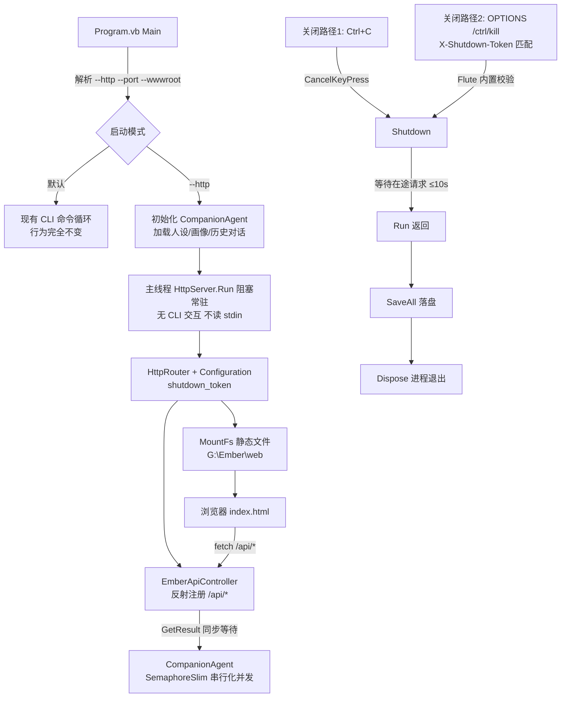

## 用户需求

为 Ember.vbproj（VB.NET net10.0 控制台项目，Flute.NET5 引用已由用户添加）添加 HTTP 服务运行模式，并配套编写 Web 聊天界面。包含三轮需求：

1. **HTTP 服务模式**：参考 Fluteway 项目用法，通过 HttpRouter 反射解析控制器实例对外提供 web api，通过 MountFs 提供静态文件服务；在 G:\Ember\web 文件夹编写 light 主题、清新活泼亮丽颜色组合的 web 界面（html+javascript）。
2. **无界面后台服务（修订）**：以 http 模式启动后，用户不再能从 cli 界面交互——http 模式即以无界面的后台服务方式常驻运行，与默认 CLI 交互模式互斥。
3. **远程关闭机制（修订）**：利用 Flute 内置的 OPTIONS /ctrl/kill 端点（由 X-Shutdown-Token 请求头与服务器配置 token 匹配校验），实现用户从 Web 远程安全关闭 http 服务，并在关闭前自动保存 agent 的全部数据。

## 产品概述

- **CLI 模式（默认，无参数）**：现有命令行交互行为完全不变
- **HTTP 模式（--http）**：加载人设/画像/对话历史后启动 Web 服务器常驻运行（无 CLI 交互），对外提供 REST API 与静态 Web 页面；Ctrl+C 或远程 /ctrl/kill 均触发优雅关闭——先停止 HTTP 服务等待在途请求完成，再统一落盘退出

## 核心功能

- **互斥双模式启动**：--http [--port N] [--wwwroot 目录] 启动后台服务；两模式共享同一数据目录，人设/画像/对话记忆互通
- **Web API**：对话（含思考过程）、历史消息、人设查看/设置/重置、用户画像查看/手动总结、运行状态、手动保存
- **Web 聊天界面**：启动加载历史、发消息、思考动画、打字机式回复、思考过程折叠、人设编辑、画像刷新、手动保存、连接状态指示
- **远程安全关闭**：状态接口暴露“远程关闭是否启用”标志（不泄露 token 明文）；Web 界面据此显示关闭按钮，用户输入 token 确认后远程关闭服务，服务器在退出前自动保存全部 agent 数据
- **并发安全**：多浏览器标签/并发请求对对话记忆的访问串行化，避免数据损坏
- **配置管理**：settings.ini 新增 [web] 节（端口、wwwroot、shutdown_token），命令行参数可覆盖

**视觉效果**：奶油白暖底 + 珊瑚橙渐变主色的清新活泼 light 主题聊天界面，圆角卡片配柔和彩色阴影，火焰/人物 emoji 头像传递温暖感，气泡滑入、思考圆点跳动、打字机逐字呈现等微动效营造亲切灵动的陪伴氛围。

## Tech Stack

- **语言/平台**：VB.NET net10.0（沿用现有项目；vbproj 已含 Flute.NET5 引用，无需改动）
- **HTTP 服务**：Flute 库 HttpRouter（反射控制器 + MountFs 静态文件）+ HttpSocket + Configuration（shutdown_token）
- **前端**：原生 HTML + CSS + JavaScript 三文件（G:\Ember\web），无构建工具；style.css 头部 @import Tailwind CDN 作工具类基础，核心组件视觉以自定义 CSS 变量实现（离线时核心界面仍完整可用）

## Implementation Approach

### 关键决策

1. **模式互斥（修订一核心）**：--http 时不进入 CLI 循环、不读 stdin（服务化部署 stdin 可能重定向/关闭）；主线程直接调用 HttpServer.Run() 阻塞常驻（Flute 设计即如此）；Ctrl+C 经 CancelKeyPress 触发 Shutdown + SaveAll
2. **远程关闭集成（修订二核心，零库改动）**：Flute 的 HttpSocket.handleOtherMethod 内置 OPTIONS /ctrl/kill 端点——校验请求头 X-Shutdown-Token 与 Configuration.shutdown_token 严格 Ordinal 匹配：token 空→"Remote shutdown is disabled."；不匹配→"Invalid shutdown token."；匹配→"OK!"+自动 Shutdown()。Ember 侧仅需：ini 配置 shutdown_token → 构造 HttpSocket 时传入 Configuration → Run() 返回后主线程统一 SaveAll 落盘退出。**两条关闭路径（Ctrl+C 与远程 kill）在“Run() 返回后统一落盘”汇合，无需修改 Flute 库**
3. **安全设计**：/api/status 仅返回 remoteShutdownEnabled 布尔标志（绝不泄露 token 明文）；token 默认空=远程关闭禁用；前端仅当 enabled=true 才显示关闭按钮
4. **并发互斥**：Flute 用 ThreadPool 多线程处理请求，并发请求会同时访问非线程安全的 ChatContextMemory/LLMClient；VB 的 SyncLock 块内不允许 Await，故用 SemaphoreSlim(1,1).WaitAsync() 串行化全部读写操作；worker 线程无 SynchronizationContext，handler 内 .GetAwaiter().GetResult() 等待异步无死锁
5. **wwwroot 三级解析**：ini [web] wwwroot → 命令行 --wwwroot 覆盖 → 自动探测（exe 同级 web → 向上逐级查找 web 目录最多 6 级，开发环境自动命中 g:\Ember\web）→ 回退 exe 同级 web 并提示
6. **端口占用**：启动前 Tcp.PortIsAvailable 预检测，占用则报错退出（显式请求不静默降级）

### 架构与数据流



### REST API 契约（统一 {code, info} 格式，code=0 成功；DataContractJsonSerializer 属性名区分大小写）

| 方法 | 路径 | 请求 | info 响应 |
| --- | --- | --- | --- |
| GET | /api/status | - | {backend, model, turns, tokens, maxTokens, personaName, personaIsDefault, profileUpdated, autosave, dataDir, remoteShutdownEnabled} |
| GET | /api/persona | - | {name, description, isDefault, updatedAt} |
| POST | /api/persona | {description} | {ok} |
| POST | /api/persona/reset | - | {ok} |
| GET | /api/profile | - | {summary, traits[], interests[], emotionalState, communicationStyle, updatedAt, isEmpty} |
| POST | /api/profile/refresh | - | {updated} |
| GET | /api/history?limit=50 | query | {messages:[{role, content}]} |
| POST | /api/chat | {message} | {reply, think, turn} |
| POST | /api/save | - | {ok} |


（OPTIONS /ctrl/kill 为 Flute 内置端点不走 HttpRouter；remoteShutdownEnabled 指示是否配置了 shutdown_token，前端据此显示关闭按钮）

### 已验证的 Flute API

- `New HttpRouter(controller)`：反射注册带 `<HttpGet("/url")>`/`<HttpPost("/url")>` 特性（Flute.Http.Core.Message.HttpHeader 命名空间）的 `Sub(request As HttpRequest, response As HttpResponse)` 方法；`.MountFs(New WebFileSystemListener(New FileSystem(wwwroot)))`；分发先查静态文件再查路由
- `New HttpSocket(router As IAppHandler, port%, Optional threads%, Optional configs As Configuration, Optional jsonParser)`——configs 即携带 shutdown_token 的配置对象
- `HttpServer.Run()` 阻塞式 accept 循环（Is_active=False 后退出返回 0）；`Shutdown()` 优雅关闭（停止监听+关闭 ws/longpoll+等在途 worker ≤10s，容忍调用 worker 自身）
- `HttpResponse.WriteJSON(Of T)(obj)` / `WriteError(code, msg)` / `AccessControlAllowOrigin`；Flute.Extensions 全局模块 `SuccessMsg/FailureMsg`（{code, info}）
- `HttpPOSTRequest`：`DirectCast(request, HttpPOSTRequest)("field").DefaultValue` 读 JSON body 字段（Fluteway 同款用法）
- `WebFileSystemListener`：内置路径穿越防护、目录→index.html 重定向、CORS *、大小文件分流

## Implementation Notes

- **不改动 Ollama/Flute 库**：全部改动限于 Ember 项目内
- API handler 全 try/catch → FailureMsg(500)，绝不让 worker 线程崩溃；AccessControlAllowOrigin="*"
- LLMClient 流式 token 固定 Console.Write → HTTP 模式作为服务 stdout 运行日志（Flute 既有行为）
- JSON DTO 属性名区分大小写，前端 JS 按契约字段名精确访问
- 回滚安全：不加 --http 时所有新代码路径不执行，CLI 行为零变化

## Directory Structure

```
g:\Ember\src\Ember\
├── Ember.vbproj              [不变] Flute 引用已由用户添加
├── Program.vb                [MODIFY] 解析 --http/--port/--wwwroot；--http 时初始化 agent 后主线程 Run() 常驻（不进 CLI 循环不读 stdin），Run() 返回后统一 SaveAll 落盘退出（Ctrl+C 与远程 kill 汇合点）；默认路径保持现有 CLI 行为零变化
├── CompanionAgent.vb         [MODIFY] 新增 SemaphoreSlim(1,1)：ChatCoreAsync/SetPersona/ResetPersona/UpdateProfileAsync/SaveAll/快照读取全部经 WaitAsync 串行化；新增 ChatCoreAsync（返回 think+output+turn 结构化结果）、GetStatusSnapshot/GetPersonaSnapshot/GetProfileSnapshot/GetRecentHistory(limit) 线程安全快照方法；CLI 入口统一改调 ChatCoreAsync
├── Config\
│   └── EmberConfig.vb        [MODIFY] 新增 [web] 节：http_port(默认8080)、wwwroot(空=自动探测)、shutdown_token(空=禁用远程关闭，注释说明启用方式与安全提示)；新增 ResolveWwwroot(cliOverride) 三级解析
├── Web\
│   ├── EmberWebServer.vb     [NEW] HTTP 服务封装：组装 HttpRouter(controller).MountFs(WebFileSystemListener) → New HttpSocket(router, port, configs:=Configuration With {.shutdown_token=...})；构造时 Tcp.PortIsAvailable 预检；暴露 Run()/Shutdown()/Port；持有 CompanionAgent 与解析后的 wwwroot
│   └── EmberApiController.vb [NEW] 全部 /api/* 端点控制器：HttpGet/HttpPost 特性标注 + Sub 签名（反射路由硬性要求）；handler 内 GetAwaiter().GetResult() 同步等待 + 全局异常捕获 + CORS 头

G:\Ember\web\                 [NEW] 静态前端
├── index.html                [NEW] 单页四区块：顶栏（logo+连接状态点+模型徽章）、左侧栏（人设卡：编辑/恢复默认；画像卡：五字段标签化+重新总结；状态卡：轮次/token 进度条+2秒轮询；底部手动保存+远程关闭按钮）、聊天主区（历史加载/气泡消息/思考动画/思考过程折叠）、输入区（自动增高 textarea+Enter 发送）
├── style.css                 [NEW] Tailwind CDN @import + CSS 变量 + 自定义组件样式（light 清新活泼主题全部核心视觉，离线可用）
└── app.js                    [NEW] fetch 封装、历史加载渲染、发消息+打字机效果、思考动画、人设编辑弹层、画像刷新、状态轮询、手动保存、远程关闭流程（token 确认对话框 → OPTIONS /ctrl/kill → 告别界面）
```

### 远程关闭时序（关键链路）

1. 用户点击 Web 界面“关闭服务”按钮（仅 remoteShutdownEnabled=true 时显示）→ 弹出确认对话框输入 token
2. 前端 `fetch('/ctrl/kill', {method:'OPTIONS', headers:{'X-Shutdown-Token':token}})`
3. Flute handleOtherMethod 校验：匹配 → 返回 "OK!" + 自动 Shutdown()（等待在途请求完成）；失败返回对应错误文本
4. Shutdown 后 HttpServer.Run() 循环退出返回 → Program.vb 主线程统一执行 agent.SaveAll() + Dispose → 进程退出
5. 前端根据响应文本显示告别界面（“服务已安全关闭，记忆已保存”）或错误提示；轮询 /api/status 失败确认服务已停

## 设计方案

原生 HTML/CSS/JS 单页聊天应用（无构建工具、无框架依赖），light 主题清新活泼亮丽风格。布局采用“顶栏 + 左侧信息栏(320px) + 聊天主区 + 底部输入区”四区块结构，窄屏(<900px)时侧栏收起为汉堡按钮抽屉。

**四区块设计**：

1. 顶栏：火焰 logo 图标 + “Ember · 你的情感陪伴伙伴”标题；右侧连接状态圆点（薄荷绿=在线，灰=不可达）+ 模型名小徽章
2. 左侧信息栏：人设卡（珊瑚橙渐变圆形头像+描述摘要+编辑/恢复默认按钮）；画像卡（总体印象段落+性格/兴趣彩色胶囊标签+情绪/沟通偏好+重新总结按钮，空态文案“多聊几轮后我会更懂你”）；状态卡（后端/模型/轮次/token 迷你进度条/保存模式，2秒轮询）；底部手动保存（柠檬黄描边）+ 远程关闭按钮（警示红，仅启用时显示）
3. 聊天主区：用户消息右侧珊瑚橙渐变白字圆角气泡+人物头像；Ember 消息左侧白色柔阴影气泡+火焰头像；思考中显示三个跳动渐变圆点；回复下方提供思考过程可折叠灰色小字区
4. 输入区：自动增高 textarea（Enter 发送/Shift+Enter 换行）+ 珊瑚橙渐变圆角发送按钮（发送中禁用转圈）

**微动效**：气泡滑入、按钮呼吸、思考圆点跳动、打字机逐字呈现（15-30ms/字符）、人设保存成功薄荷绿 toast 滑入、画像刷新弹跳强调。消息区滚动跟随最新消息，用户上滚时暂停跟随。style.css 头部 @import Tailwind CDN 提供工具类基础，核心视觉全部用自定义 CSS 变量与规则实现，保证离线环境界面完整。