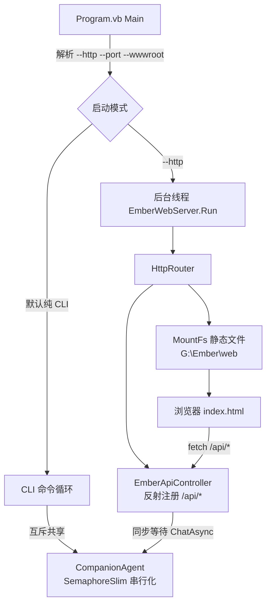

## Product Overview

为 Ember 情感陪伴智能体添加 HTTP 服务运行模式：通过命令行参数 `--http` 启动内嵌 Web 服务器后，用户既可继续在命令行对话，也可通过浏览器访问 Web 聊天界面。同时编写一套 light 主题、清新活泼亮丽配色的 Web 前端界面（放置于 G:\Ember\web）。

## Core Features

- **双模式启动**：默认纯 CLI（现有行为不变）；加 `--http` 后 HTTP 服务跑后台线程，CLI 循环继续可用，两种入口共享同一智能体（人设、画像、对话记忆实时互通）
- **Web API 服务**：基于 Flute 的 HttpRouter 反射控制器提供 REST API——对话（含思考过程）、历史消息、人设查看/设置/重置、用户画像查看/手动总结、运行状态、手动保存
- **静态 Web 界面**：MountFs 挂载 G:\Ember\web 目录提供 HTML+JS 聊天界面，含左侧信息栏（人设卡、画像卡、状态卡）与右侧聊天主区
- **Web 聊天体验**：历史消息加载、发消息、思考中动画、打字机式回复呈现、思考过程折叠查看、人设编辑、画像刷新、手动保存
- **安全退出**：CLI 退出或 Ctrl+C 时先优雅关闭 HTTP 服务（Shutdown 等待在途请求完成）再统一落盘
- **配置管理**：settings.ini 新增 [web] 节（端口、wwwroot、开关），命令行参数可覆盖

## Tech Stack Selection

- **语言/平台**：VB.NET net10.0（沿用现有项目，Flute 引用用户已添加，vbproj 无需改动）
- **HTTP 服务**：Flute 库 `HttpRouter`（反射注册控制器 + `MountFs` 静态文件）+ `HttpSocket`（`New HttpSocket(router, port)` 直接接受 IAppHandler）
- **关键 API（已验证）**：
- `New HttpRouter(controller)` 反射注册带 `<HttpGet("/url")>`/`<HttpPost("/url")>` 特性的 `Sub(request As HttpRequest, response As HttpResponse)` 方法（特性位于 `Flute.Http.Core.Message.HttpHeader` 命名空间）
- `.MountFs(New WebFileSystemListener(New FileSystem(wwwroot)))`（Flute.Http.FileSystem，内置路径穿越防护与 index.html 重定向、CORS *）
- `HttpServer.Run()` 阻塞式（后台线程调用）；`Shutdown()` 优雅关闭（等待在途 worker ≤10s）；`isRunning` 属性
- `response.WriteJSON(Of T)(obj)`、`response.SuccessMsg(Of T)(msg)`/`FailureMsg(Of T)(msg, code)`（{code, info} 格式）
- `HttpPOSTRequest`：`request("message").DefaultValue` 读取 JSON body 字段
- **前端**：原生 HTML + CSS + JavaScript 三文件，无构建工具、无外部依赖

## Implementation Approach

### 架构与数据流



### 关键决策

1. **并发互斥（核心难点）**：CLI 与 Web 共享同一个 CompanionAgent，而 ChatContextMemory/LLMClient 非线程安全。VB 的 `SyncLock` 块内不允许 `Await`，故采用 `SemaphoreSlim(1,1).WaitAsync()` 串行化全部读写操作（对话、人设修改、画像总结、保存）。互斥粒度=整个操作（对话含 LLM 请求耗时较长，串行可保证记忆一致性；情感陪伴场景并发低，可接受）
2. **HTTP worker 线程同步等待异步**：Flute 用 ThreadPool 跑请求 handler（无 SynchronizationContext），在 handler 内 `.GetAwaiter().GetResult()` 等待 `ChatAsync` 无死锁风险。POST /api/chat 返回完整 {reply, think, turn}，前端用打字机动画模拟流式（第一版不引入 LongPoll/SSE 复杂度）
3. **状态快照模式**：CompanionAgent 新增 `AgentStatusSnapshot`/`PersonaSnapshot` 结构，在互斥锁内生成快照返回，避免 HTTP 读取状态与 CLI 写入竞态
4. **wwwroot 三级解析**：ini [web] wwwroot 显式配置 → 命令行 `--wwwroot` 覆盖 → 自动探测（exe 同级 `web\` → 从 exe 目录向上逐级查找名为 web 的目录，最多 6 级，开发环境自动命中 g:\Ember\web；均失败回退 exe 同级 web 并提示）
5. **端口占用处理**：启动前检测，占用则报错退出（HTTP 模式是用户显式请求，静默降级会造成困惑）；ini 默认端口 8080

### REST API 契约（统一 {code, info} 格式，code=0 成功）

| 方法 | 路径 | 请求 | info 响应 |
| --- | --- | --- | --- |
| GET | /api/status | - | {backend, model, turns, tokens, maxTokens, personaName, personaIsDefault, profileUpdated, autosave, dataDir} |
| GET | /api/persona | - | {name, description, isDefault, updatedAt} |
| POST | /api/persona | {description} | {ok} |
| POST | /api/persona/reset | - | {ok} |
| GET | /api/profile | - | {summary, traits[], interests[], emotionalState, communicationStyle, updatedAt, isEmpty} |
| POST | /api/profile/refresh | - | {updated}（同步等待画像总结完成） |
| GET | /api/history?limit=50 | query | {messages:[{role, content}]} |
| POST | /api/chat | {message} | {reply, think, turn} |
| POST | /api/save | - | {ok} |


### 性能与可靠性

- 画像总结仅在互斥锁内的对话轮次达阈值时触发（现有逻辑复用），POST /api/profile/refresh 手动触发同样走互斥锁
- HTTP 模式下 LLMClient 内部固定 Console.Write 的流式 token 输出到服务器控制台（作为运行日志，可接受、无法关闭属 Flute 既有行为）
- 所有 API handler 全 try/catch，异常走 FailureMsg 返回 code=500，绝不让 worker 线程崩溃
- 静态文件由 WebFileSystemListener 托管：小文件内存缓冲、大文件流式、路径穿越防护均为库内置
- Shutdown 顺序：CLI 收到退出/Ctrl+C → HTTP Shutdown()（等在途请求） → agent.SaveAll() → Dispose

## Directory Structure

```
g:\Ember\src\Ember\
├── Ember.vbproj              [不变] Flute 引用用户已添加
├── Program.vb                [MODIFY] 解析 --http/--port/--wwwroot 参数；--http 时后台线程启动 WebServer、主线程继续 CLI 循环；退出时先 Shutdown HTTP 再落盘
├── CompanionAgent.vb         [MODIFY] 新增 SemaphoreSlim(1,1) 互斥：ChatAsync/SetPersona/ResetPersona/UpdateProfileAsync/SaveAll 包裹 WaitAsync；新增 GetStatusSnapshot/GetPersonaSnapshot/GetProfileSnapshot/GetRecentHistory(limit) 线程安全只读方法；新增 ChatCoreAsync（返回 think+output+turn 的结构化结果）
├── Config\
│   └── EmberConfig.vb        [MODIFY] 新增 [web] 节：http_enabled(bool)、http_port(默认8080)、wwwroot(空=自动探测)；新增 ResolveWwwroot(cliOverride) 三级解析方法
├── Web\
│   ├── EmberWebServer.vb     [NEW] HTTP 服务封装：组装 HttpRouter(controller).MountFs(WebFileSystemListener) → HttpSocket；StartAsync 后台线程 Run + 端口检测；Shutdown 优雅停止；持有 CompanionAgent 与解析后的 wwwroot
│   └── EmberApiController.vb [NEW] API 控制器：全部 /api/* 端点（上表契约），HttpGet/HttpPost 特性标注，handler 内 GetAwaiter().GetResult() 同步等待 + 全局异常捕获
└── （bin 输出目录运行时数据不变）

G:\Ember\web\                 [NEW] 静态前端
├── index.html                [NEW] 单页结构：顶栏（logo+连接状态）、左侧栏（Ember人设卡/用户画像卡/状态卡/保存按钮）、聊天主区（消息流+思考动画）、底部输入区
├── style.css                 [NEW] light 清新活泼主题：奶油白底、珊瑚橙渐变气泡、白色柔阴影气泡、圆角卡片、微动效
└── app.js                    [NEW] API 客户端（fetch 封装）、历史加载渲染、发消息+打字机效果、思考中三点动画、思考过程折叠、人设编辑弹层、画像刷新、状态轮询、手动保存
```

## Key Code Structures

```
' Ember\Web\EmberApiController.vb 控制器方法签名示例（HttpGet/HttpPost 特性 + Sub 签名是反射路由的硬性要求）
Imports Flute.Http.Core
Imports Flute.Http.Core.Message
Imports Flute.Http.Core.Message.HttpHeader   ' HttpGet / HttpPost 特性

Public Class EmberApiController
    ReadOnly _agent As CompanionAgent

    Sub New(agent As CompanionAgent)
        _agent = agent
    End Sub

    <HttpGet("/api/status")>
    Public Sub GetStatus(request As HttpRequest, response As HttpResponse)
        ' 互斥快照读取 + response.SuccessMsg(snapshot)
    End Sub

    <HttpPost("/api/chat")>
    Public Sub Chat(request As HttpRequest, response As HttpResponse)
        ' DirectCast(request, HttpPOSTRequest) → request("message").DefaultValue
        ' → _agent.ChatCoreAsync(msg).GetAwaiter().GetResult() → SuccessMsg
    End Sub
End Class

' CompanionAgent.vb 互斥模式（VB SyncLock 块内禁止 Await，改用 SemaphoreSlim）
Private ReadOnly _gate As New SemaphoreSlim(1, 1)

Public Async Function ChatCoreAsync(userInput As String) As Task(Of ChatResult)
    Await _gate.WaitAsync()
    Try
        ' 复用现有对话/计数/自动保存/周期画像总结逻辑，返回 think+output+turn
    Finally
        Call _gate.Release()
    End Try
End Function
```

## Implementation Notes

- **不改动 Ollama 库**：本轮全部改动限于 Ember 项目内（LLMClient 此前已加 Context 属性）
- **CLI 与 Web 互斥**：Program.vb 的 CLI 对话入口也改走 ChatCoreAsync（经同一 SemaphoreSlim），确保命令行与浏览器同时对话时记忆不损坏
- **API 响应 JSON 序列化**：控制器内构造匿名类型或简单 DTO（公共属性），WriteJSON/SuccessMsg 内部用 GetJson（DataContractJsonSerializer，属性名区分大小写——前端 JS 按契约字段名精确访问）
- **CORS**：静态资源由 WebFileSystemListener 自动带 `AccessControlAllowOrigin=*`；API 响应需手动设置 `response.AccessControlAllowOrigin = "*"`（同源部署其实不需要，但为本地调试 dev 端口分离留余地）
- **浏览器端错误处理**：fetch 非 200 或 code!=0 时显示气泡内错误提示并恢复输入框，不卡死 UI
- **回滚安全**：不加 --http 时所有新代码路径不执行，现有 CLI 行为零变化

## 设计风格

原生 HTML/CSS/JS 单页应用，light 主题清新活泼亮丽风格：奶油白暖底 + 珊瑚橙渐变主色 + 薄荷绿/天空蓝/柠檬黄点缀，圆角卡片配柔和彩色阴影，emoji 头像传递温暖感，微动效（气泡滑入、按钮呼吸、思考圆点跳动）营造亲切灵动的陪伴氛围。

## 页面结构（单页四区块）

1. **顶栏**：左侧 🔥 logo + "Ember · 你的情感陪伴伙伴" 标题；右侧连接状态圆点（绿=在线轮询 /api/status，灰=服务不可达）+ 模型名小徽章
2. **左侧信息栏**（320px，窄屏折叠为抽屉）：

- Ember 人设卡：🔥 渐变圆形头像、名字、人设描述摘要、"编辑人设"按钮（弹出 textarea 编辑层，保存调 POST /api/persona）、"恢复默认"次按钮
- 用户画像卡：五字段标签化展示（总体印象段落 + 性格/兴趣彩色胶囊标签 + 情绪/沟通偏好行）、"重新总结"按钮（调 /api/profile/refresh 后刷新）、空态显示"多聊几轮后我会更懂你"
- 状态卡：后端/模型/轮次/token 用量迷你进度条/保存模式，2 秒轮询刷新
- 底部手动保存按钮（柠檬黄描边样式）

3. **聊天主区**：消息流（用户消息右侧珊瑚橙渐变白字圆角气泡 + 🧑 头像；Ember 消息左侧白色气泡柔阴影 + 🔥 头像；历史消息经 /api/history 启动加载）；Ember 回复下方提供"思考过程"可折叠灰色小字区（think 文本）；等待回复时显示 Ember 头像 + 三个跳动渐变圆点的思考动画
4. **底部输入区**：自动增高 textarea（Enter 发送 / Shift+Enter 换行）+ 珊瑚橙渐变圆角发送按钮（发送中禁用转圈），上方一行浅色快捷提示文字

## 交互细节

- 回复打字机效果：按 15-30ms/字符逐字呈现，完成后折叠区渲染思考文本
- 人设编辑保存成功后顶部滑入薄荷绿 toast 提示；画像刷新成功后画像卡轻微弹跳强调
- 消息区滚动跟随最新消息；用户上滚时暂停自动跟随
- 响应式：<900px 侧栏收起为顶部汉堡按钮抽屉；聊天区全宽