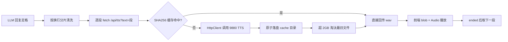

## 用户需求

为 Ember Web 界面添加 TTS 语音合成功能（共四部分）：

1. **基础朗读**：Web 端获得 LLM 完整回复后，通过本机 TTS API（`http://127.0.0.1:9880/?text=<文本>&text_language=zh`，返回 wav）获取语音并在页面播放
2. **语音缓存（新增）**：TTS 合成的 wav 缓存到 `App.ProductProgramData/cache` 文件夹，容量上限 2GB；程序重启后可直接听到已缓存的语音
3. **分片合成（新增）**：LLM 输出按换行符分割为多行，逐段依次合成与播放，避免文本过长导致合成失败或单次等待时间过长
4. **CDN 本地化（新增）**：将 Web 页面引用的外部 CDN 资源缓存到本地 `G:\Ember\agent\web\resource\vendor`，实现离线可用

## 核心功能

- 后端 `GET /api/tts` 代理端点：转发请求到可配置的 TTS 服务并回传 wav（规避浏览器跨域限制）
- wav 文件缓存：以文本+语言的哈希为键落盘，命中直接秒回；超 2GB 按最旧优先淘汰
- 前端分片顺序播放：回复按换行分片，首段短文本秒级发声，逐段“合成→播放→下一段”；新对话开始自动打断上一条朗读
- 语音开关：顶栏按钮切换开启/关闭，localStorage 记忆偏好；每条回复提供手动重播按钮
- 状态反馈：合成中（呼吸动画，显示第 x/y 段）与播放中（音波跳动动画）状态条
- 容错降级：TTS 服务离线时 502、前端单次提示后静默；单段失败跳过续播；聊天主流程零影响
- 页面零外部网络依赖：Tailwind CDN 下载至 vendor 本地引用

## 视觉效果

现有四区块界面新增：顶栏音量开关按钮（随开关切换图标）、Ember 回复气泡下的重播小按钮与 TTS 状态条（合成中呼吸/播放中音波动画），全部使用现有主题 CSS 变量，五套主题自动适配。

## Tech Stack

- **后端**：VB.NET net10.0；复用 Flute 的 `HttpResponse.WriteHttp(Content)` + `SendData(Byte())` 二进制响应链路（静态文件同款用法，已验证）；`System.Net.Http.HttpClient` 静态共享实例（Timeout 120s 适配长文本合成）
- **缓存**：SHA256 哈希键 + 文件落盘 + 容量 LRU 淘汰（无需引入数据库）
- **前端**：原生 JavaScript fetch + Blob + Audio API；localStorage 持久化偏好

## Implementation Approach

### 架构决策

1. **后端代理而非浏览器直连**：浏览器从 Ember 页面直连 9880 属跨域请求，TTS 服务无 CORS 头会被拦截；由后端同源代理 `/api/tts`，附带收益：TTS 地址可入 ini 配置、超时可控、可实现服务端缓存
2. **缓存键 = SHA256(text|language) 十六进制** → `{sha256}.wav`：同一文本（含分片后的单段）天然去重复用；重启程序后已合成语音直接秒回
3. **分片在前后端配合**：前端按换行分割并逐段请求（每段是一次独立的 `/api/tts?text=单段` 调用），后端单段超长兜底截断（500 字符、句边界优先）；首段通常秒级发声，整体无需一次性等待
4. **TTS 为无状态代理端点**：不触碰 agent 互斥门（不读写对话记忆），仅依赖 EmberConfig 配置项

### 数据流



### 后端实现（g:\Ember\src\Ember）

**1. EmberConfig.vb**：

- `[web]` 节新增 `tts_url`（默认 `http://127.0.0.1:9880/`）与 `tts_language`（默认 `zh`），沿用 `ini.ReadString(SECTION_WEB, ...)` 读写模式，WriteDefaultIni 补默认键与注释
- 新增 `CacheDirectory` 只读属性：`App.ProductProgramData` 下平级 `cache` 目录（与现有 `DataDirectory` 同款解析与创建模式）

**2. Web\EmberApiController.vb 新增 `GET /api/tts?text=...`**：

- text 为空返回 400（错误信封）；超 500 字符按句号/感叹号/换行边界截断兜底
- 缓存查询：`SHA256(text + "|" + language)` → `{cache}\{hash}.wav`，命中直接 `WriteHttp(audio/wav) + SendData`（含正确 Content-Length）
- 未命中：HttpClient 请求 TTS 服务，成功后**原子落盘**（先写 `.tmp` 再 `File.Move`）再回传；失败/超时/非 2xx 返回 `WriteError(502, "TTS 服务不可用...")`，worker 不崩溃，失败结果不缓存
- 容量控制常量 `CACHE_LIMIT = 2GB`：每次写入后统计目录总大小，超限按 `LastWriteTime` 从最旧开始删除直到低于上限（淘汰仅针对缓存文件，异常静默不影响主流程）

### 前端实现（G:\Ember\agent\web）

**1. index.html**：顶栏 topbar-right 新增 TTS 开关按钮 `ttsToggleBtn`（icon-btn 样式）

**2. resource\javascript\app.js**：

- `state.ttsEnabled = localStorage['ember-tts'] !== 'off'`（默认开启）；开关切换即写 localStorage + toast 确认，关闭时立即打断当前播放
- `stopCurrentTts()`：暂停当前 audio + 清空播放队列 + revoke 全部 objectURL（新对话/重播/关闭开关时调用，防重叠）
- 分片逻辑：回复定格后将 reply 按 `\r\n`/`\n` 分割，跳过空段，清洗每段 markdown 星号动作标记与首尾空白
- 顺序队列：段1 合成→播放→`ended` 后段2 合成→播放（串联推进）；某段失败（502/超时）跳过继续下一段，全部失败才 toast 一次（每会话最多一次）后静默降级
- 状态条：插入回复气泡下方，"🔊 合成中（第 x/y 段）”呼吸动画 → 播放中音波跳动动画 → 全部结束移除
- `sendMessage()` 回复定格处（appendThinkBlock 之后）触发自动朗读；每条新 Ember 回复气泡下加重播按钮（与 think-block 同级），点击对整条文本重新分片播放
- 播放完成自动 `revokeObjectURL` 防内存泄漏；用户已点击发送按钮，`audio.play()` 不受自动播放策略限制

**3. resource\styles\style.css**：新增 `.tts-btn`（重播小按钮）与 `.tts-status` 样式，合成中 `breathe` 呼吸、播放中 `wave` 音波跳动 keyframes，全部使用现有主题 CSS 变量配色

### CDN 本地化

- 执行阶段下载 `https://cdn.jsdelivr.net/npm/tailwindcss@2.2.19/dist/tailwind.min.css` → `G:\Ember\agent\web\resource\vendor\tailwind.min.css`（勘察确认全站仅此一处外部 CDN 引用，字体为系统字体栈）
- `style.css` 第 7 行 `@import` 改为相对路径 `../vendor/tailwind.min.css`
- 结果：页面零外部网络依赖，完全离线可用

## Directory Structure

```
g:\Ember\src\Ember\
├── Config\EmberConfig.vb        [MODIFY] [web] 新增 tts_url/tts_language；新增 CacheDirectory 属性（App.ProductProgramData\cache）
└── Web\EmberApiController.vb    [MODIFY] 新增 GET /api/tts：校验截断、SHA256 缓存查询、HttpClient 转发、原子落盘、2GB LRU 淘汰、wav 回传、502 容错

G:\Ember\agent\web\
├── index.html                   [MODIFY] 顶栏新增 TTS 开关按钮
├── resource\javascript\app.js   [MODIFY] 开关状态、分片顺序合成播放、打断控制、重播按钮、状态条、失败静默降级
├── resource\styles\style.css    [MODIFY] tts-btn/tts-status 样式与呼吸/音波动画；@import 改本地 vendor 路径
└── resource\vendor\
    └── tailwind.min.css         [NEW] 从 jsdelivr CDN 下载的本地副本

运行时：%LOCALAPPDATA%\Ember\cache\{sha256}.wav（自动创建与淘汰）
```

## Implementation Notes

- HttpClient 静态共享避免每请求建连；TTS 合成期间 Flute worker 线程同步等待（与 /api/chat 同款模式，无 SynchronizationContext 无死锁风险）
- 缓存淘汰在写入路径同步执行（简单可靠；单次淘汰量小，2GB 上限下开销可忽略），异常静默
- 分片使单次 TTS 请求文本短、成功率高且首响快；后端 500 字符截断作为极端单行的兜底双保险
- 不修改 Ollama/Flute 库；CLI 模式零影响（纯新增端点与前端逻辑）
- 回滚安全：TTS 功能完全独立于聊天主链路，任意环节失败均静默降级

## Agent Extensions

### Skill

- **agent-browser**
- Purpose: 最终验证阶段打开 Ember Web 页面，实际发送含换行的对话消息，截图确认 TTS 分片“合成中（第 x/y 段）→播放中”状态条、重播按钮与语音开关的视觉效果；重启服务后重播验证缓存命中；验证开关切换与 localStorage 偏好在刷新后保持
- Expected outcome: 获得 TTS 自动朗读全流程（分片合成、顺序播放、缓存秒回、开关记忆）的可视化验证截图，确认 UI 元素在主题下正常渲染