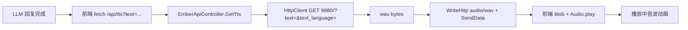

## 用户需求

为 Ember Web 界面添加 TTS 语音合成功能：Web 端在获得 LLM 完整回复输出后，通过本机 TTS API（http://127.0.0.1:9880/?text=需要朗读的文本&text_language=zh）获取合成的 wav 语音文件，并在 Web 页面上播放出来。

## 需求补充与澄清

- TTS 服务已实测在线（GPT-SoVITS 风格，返回 200 / audio/wav / 约 300KB，长文本合成耗时数十秒）
- 浏览器直接访问 9880 端口属跨域请求且 TTS 服务无 CORS 头，必须由 Ember 后端代理转发（同源 /api/tts）
- TTS 服务地址与语言应可配置（ini [web] 节），默认 http://127.0.0.1:9880/ 与 zh

## 产品概述

为现有 Web 聊天界面增加语音朗读能力：每轮 LLM 回复完成后自动调用后端 TTS 代理获取语音并播放；提供全局语音开关（记住用户偏好）、单条消息重播按钮、合成中/播放中的视觉反馈；TTS 服务不可用时静默容错，不影响聊天主流程。

## 核心功能

- 后端 TTS 代理端点 GET /api/tts?text=...：转发到可配置的 TTS 服务并回传 wav 二进制流
- 自动朗读：回复定格后自动合成播放，新对话开始时自动打断上一条朗读，避免重叠
- 语音开关：顶栏音量按钮切换开启/关闭，localStorage 记忆偏好
- 重播按钮：每条新回复下方提供手动重听入口
- 状态反馈：合成中（呼吸动画）与播放中（音波跳动动画）状态条
- 容错降级：TTS 服务离线时 502 提示一次后静默，聊天功能完全不受影响

## Tech Stack

- 后端：VB.NET net10.0，复用 Flute 的 HttpResponse.WriteHttp(Content) + SendData(byte()) 二进制响应链路（静态文件同款用法，已验证）
- HTTP 客户端：System.Net.Http.HttpClient（静态共享实例，Timeout 120 秒适配长文本合成）
- 前端：原生 JavaScript fetch + Blob + Audio API；localStorage 持久化偏好

## Implementation Approach

### 架构决策：后端代理而非浏览器直连

浏览器从 Ember 页面直接 fetch 127.0.0.1:9880 属跨域请求，GPT-SoVITS 服务不带 CORS 响应头会被浏览器拦截。因此由 Ember 后端新增同源代理端点 GET /api/tts，转发请求并回传 wav。附带收益：TTS 地址可进 ini 配置、超时可控、未来可扩展缓存。

### 数据流



### 后端实现（g:\Ember\src\Ember）

1. **EmberConfig.vb** [web] 节新增：

- `tts_url`（默认 `http://127.0.0.1:9880/`，TTS 合成服务地址）
- `tts_language`（默认 `zh`）
- ReadFromIni 用现有 `ini.ReadString(SECTION_WEB, ...)` 模式读取；WriteDefaultIni 补默认键与注释；URL 末尾无斜杠时拼接兼容

2. **Web\EmberApiController.vb** 新增 `GET /api/tts`：

- 读 query 参数 text；空返回 400（Envelope 错误信封）
- 长度保护：超过 500 字符截断（优先在句号/感叹号/换行边界截断，防止 TTS 合成超时）
- 静态共享 HttpClient（Timeout 120 秒），`GET {tts_url}?text={Uri.EscapeDataString(text)}&text_language={lang}`
- 成功：`response.AccessControlAllowOrigin = "*"` + `WriteHttp(New Content With {.type = "audio/wav", .length = N})` + `SendData(wavBytes)`（Content 为 Flute.Http.Core.Message 命名空间 Structure）
- 失败/超时/非 2xx：`WriteError(502, "TTS 服务不可用: ...")`，worker 线程不崩溃

### 前端实现（G:\Ember\agent\web）

1. **index.html**：顶栏 topbar-right 加 `ttsToggleBtn`（icon-btn 样式）
2. **app.js**：

- `state.ttsEnabled = localStorage['ember-tts'] !== 'off'`（默认开启）
- 开关按钮：切换图标（音量开/静音）、写 localStorage、toast 确认
- `stopCurrentTts()`：暂停当前 audio + revoke 旧 objectURL（防重叠）
- `synthesizeAndPlay(text, anchorBody)`：打断旧播放 → 插入“合成中”状态条 → fetch `/api/tts?text=` → blob → `new Audio(url).play()` → 状态条转播放动画 → ended/error 移除状态条
- 失败容错：toast 提示（每会话最多一次）后移除状态条静默降级
- `sendMessage()` 回复定格处（appendThinkBlock 之后）：若 ttsEnabled 则触发自动朗读
- 每条新 Ember 回复气泡下加小重播按钮（与 think-block 同级），点击手动重听
- 朗读前轻量清洗：剥离 markdown 星号动作标记与首尾空白

3. **style.css**：`.tts-btn`（重播小按钮）、`.tts-status`（合成中呼吸动画 / 播放中音波跳动 keyframes），全部使用现有主题 CSS 变量配色，五套主题自动适配

## Implementation Notes

- HttpClient 静态共享避免每请求建连；TTS 合成期间 Flute worker 线程同步等待（与 /api/chat 同款模式，无死锁风险）
- 前端 blob 播放完自动 revokeObjectURL，防内存泄漏
- 用户已点击发送按钮（页面有交互），audio.play() 不受浏览器自动播放策略限制
- 不修改 Ollama/Flute 库；CLI 模式零影响（纯新增端点与前端逻辑）

## Directory Structure

```
g:\Ember\src\Ember\
├── Config\EmberConfig.vb        [MODIFY] [web] 节新增 tts_url / tts_language 配置读写与默认注释
└── Web\EmberApiController.vb    [MODIFY] 新增 GET /api/tts 代理端点（text 校验截断、HttpClient 转发、wav 二进制回传、502 容错）

G:\Ember\agent\web\
├── index.html                   [MODIFY] 顶栏新增 TTS 开关按钮
├── resource\javascript\app.js   [MODIFY] TTS 状态与开关、synthesizeAndPlay 自动朗读、stopCurrentTts 打断、重播按钮、失败静默降级
└── resource\styles\style.css    [MODIFY] tts-btn / tts-status 样式与合成中、播放中动画（主题变量配色）
```

## Architecture Design

现有分层不变：Program（双模式入口）→ EmberWebServer（HttpRouter + MountFs 双根）→ EmberApiController（REST 端点）→ CompanionAgent（互斥编排）。TTS 为无状态代理端点，不触碰 agent 互斥门（不读写对话记忆），仅依赖 EmberConfig 的两个新配置项。

## Agent Extensions

### Skill

- **agent-browser**
- Purpose: 最终验证阶段打开 Ember Web 页面，实际发送对话消息，截图确认 TTS 合成中状态条、播放中音波动画、重播按钮与语音开关的视觉效果，并验证 localStorage 偏好在刷新后保持
- Expected outcome: 获得 TTS 自动朗读流程的可视化验证截图，确认开关状态与 UI 元素在五套主题下正常渲染