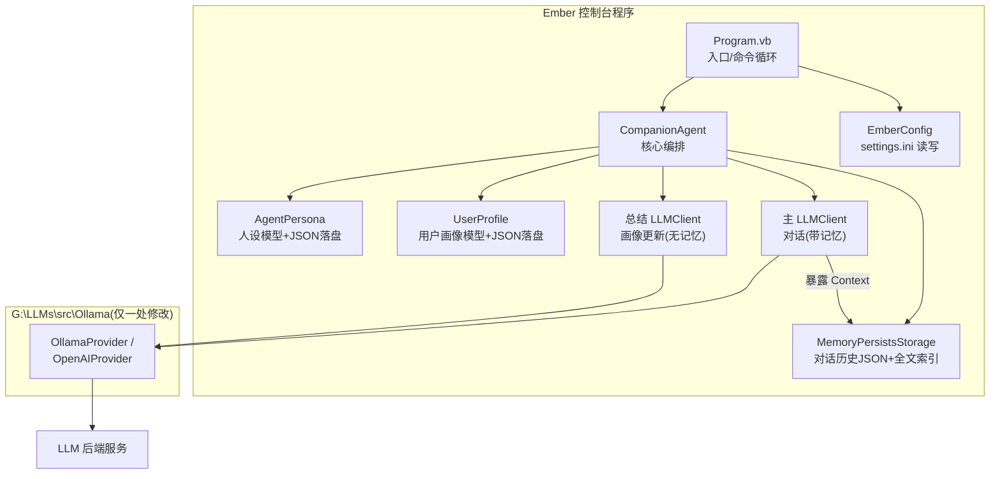

## User Requirements

在 `g:\Ember\src\Ember\Ember.vbproj`（VB.NET net10.0 控制台项目）中开发一个基于 LLM 的情感陪伴 Agent 命令行程序：

- 复用 `G:\LLMs\src\Ollama` 项目的 `LLMClient` 与 LLM 后端通信，支持 Ollama 与 OpenAI 兼容两种后端
- 复用 `MemoryPersistsStorage` 模块实现对话长期记忆的持久化（落盘/重载/模糊检索召回）
- 复用 GCModeller Core 库的 `IniFile`（`Microsoft.VisualBasic.ComponentModel.Settings.Inf` 命名空间）读写 ini 配置，管理 LLM 连接信息

## Product Overview

一个具备"人格"的情感陪伴命令行智能体：它拥有自己的性格特征（默认人设，可被用户覆盖设定），能通过与用户的对话记忆持续总结用户性格画像，并据此动态调整对话语气；所有人设、用户画像与对话历史均持久化存储，重启后自动恢复。

## Core Features

- **交互式对话循环**：命令行多轮对话，流式输出回复（含思考过程）
- **Agent 人设系统**：内置默认性格设定；用户可通过 `/persona set <描述>` 命令自定义人设，即时生效并持久化
- **用户画像动态总结**：每 N 轮对话（ini 可配）由独立总结客户端基于最近对话与召回的长期记忆更新用户画像（性格/兴趣/情绪/沟通偏好）
- **语气自适应**：系统提示词 = Agent 人设 + 用户画像 + 语气适配指令，画像更新后下一轮对话即生效
- **长期记忆持久化**：对话历史经 `MemoryPersistsStorage` 保存/加载；画像总结时通过关键词召回窗口外长期记忆作参考
- **ini 配置管理**：`settings.ini` 管理 provider 类型、服务器地址、模型名、温度、总结频率、数据目录等；首次运行自动生成带注释的默认配置
- **命令系统**：`/help`、`/exit`、`/persona set|show|reset`、`/profile`、`/status`、`/save`
- **安全退出**：正常退出与 Ctrl+C 时统一落盘对话历史、人设、用户画像

## Tech Stack Selection

- **语言/平台**：VB.NET，net10.0（沿用 `Ember.vbproj` 现有配置，项目引用已齐全，无需改动 vbproj）
- **LLM 通信**：`G:\LLMs\src\Ollama` 的 `LLMClient` + `OllamaProvider` / `OpenAIProvider`（已验证 API：`Chat()` 异步返回 `LLMsResponse.think/.output`、`system_message` 属性、`temperature` 属性、`AddSystemPrompt()`）
- **持久化记忆**：`MemoryPersistsStorage`（`Save()/Load()/RecallMessages()`，构造需传入 `ChatContextMemory` 实例）
- **配置**：GCModeller Core 的 `IniFile`（`New IniFile(path)`、`ReadValue/WriteValue/Flush`）
- **JSON 序列化**：Core 库扩展 `obj.GetJson(simpleDict:=True)` / `LoadJsonFile(Of T)(file, simpleDict:=True)`（与 MemoryPersistsStorage 落盘方式一致）

## Implementation Approach

**总体策略**：在 Ember 项目内新增 5 个源文件构成分层结构（配置层 → 人格数据层 → Agent 核心层 → 入口交互层），并对 Ollama 库的 `LLMClient.vb` 做一处最小修改以打通记忆持久化链路。

**关键决策与理由**：

1. **LLMClient 暴露 Context 属性**（唯一的外部库改动）：`MemoryPersistsStorage` 构造函数需要 `ChatContextMemory` 实例，而 LLMClient 内部 `_context` 为私有字段。新增 `Public ReadOnly Property Context As ChatContextMemory` 只读属性，向后兼容、零风险。
2. **双客户端架构**：主对话客户端（preserveMemory:=True，保留完整对话上下文）+ 画像总结客户端（preserveMemory:=False，temperature≈0.2）。总结请求作为一次性 prompt 直接传入，不污染主对话记忆——这是 `preserveMemory` 参数设计上的自然用法。
3. **系统提示词动态刷新**：已验证 `BuildRequestMessages()` 每轮请求都取最新 `system_message` 且 system 消息不入记忆队列（持久化文件不含 system 消息，重载后由程序重组），因此画像更新后直接重设 `system_message` 即可下一轮生效，无需重建客户端。
4. **画像结构化 JSON 输出**：总结客户端要求输出 JSON 画像，用 `LLMsResponse.ExtractJsonFromResponse()` 提取并反序列化为 `UserProfile`；解析失败安全回退保留旧画像，不中断会话。
5. **每轮自动保存**：情感对话数据珍贵且对话频率低，每轮结束后同步保存对话历史（`storage.Save()`），人设/画像仅在变化时保存；ini 提供 `autosave` 开关可改为仅退出时保存。

**性能与可靠性**：

- 画像总结每 N 轮才触发一次，输入限制为最近 K 条消息（默认 20 条）+ 最多 5 条召回记忆，token 开销可控
- `RecallMessages` 仅在画像总结时使用（关键词来自最近对话），避免每轮注入导致的上下文重复膨胀
- LLM 网络失败由 `LLMClient.Chat` 内部重试机制处理，主循环 catch `MaxTryRunException` 后给出友好提示，不崩溃退出
- `ChatContextMemory.MaxTokens` 从 ini 读取配置，超出后自动裁剪旧消息（裁剪前的内容仍在持久化文件与全文索引中可召回）

## Architecture Design



数据流：用户输入 → Program 命令分发 → CompanionAgent.Chat（注入最新 system prompt = 人设+画像+语气指令）→ 流式回复 → 计数达 N 轮 → 总结客户端更新画像 → 刷新 system_message → 下一轮语气自适应。

## Directory Structure

```
g:\Ember\src\Ember\
├── Ember.vbproj              [不变] 项目引用已含 Core/JSON/yaml/Ollama，无需修改
├── Program.vb                [MODIFY] 主入口：加载配置→初始化 Agent→命令循环（/help、/exit、/persona、/profile、/status、/save）；注册 Ctrl+C 保存处理
├── Config\
│   └── EmberConfig.vb        [NEW] ini 配置模型：provider/server/model/api_base/api_key/temperature/profile_interval/recent_window/max_context_tokens/data_dir/autosave；LoadOrCreate() 首次运行生成带注释默认 settings.ini；工厂方法 CreateProvider() 依据 provider 字段构造 ILLMProvider
├── Persona\
│   ├── AgentPersona.vb       [NEW] Agent 人设：Name、Description(性格设定文本)、UpdatedAt；Load/Save(JSON)；内置温暖共情型默认人设；用户 /persona set 直接覆盖 Description
│   └── UserProfile.vb        [NEW] 用户画像：Summary/Traits/Interests/EmotionalState/CommunicationStyle/UpdatedAt；Load/Save(JSON)；FromLlmJson() 容错解析 LLM 输出（失败返回 Nothing 回退旧画像）
└── CompanionAgent.vb         [NEW] 核心编排：持有主/总结双 LLMClient、MemoryPersistsStorage、Persona、UserProfile；BuildSystemPrompt() 组装人设+画像+语气适配指令；ChatAsync() 执行对话并每轮自动保存；UpdateProfileAsync() 每 N 轮触发画像总结（输入=当前画像+最近K条消息+RecallMessages 召回）；SaveAll()/Dispose() 统一落盘

G:\LLMs\src\Ollama\
└── LLMClient.vb              [MODIFY] 新增 Public ReadOnly Property Context As ChatContextMemory（暴露私有 _context，供 MemoryPersistsStorage 挂载），约 5 行改动
```

运行时数据目录（默认 `程序目录\data\`，ini 可配）：`settings.ini`、`agent_persona.json`、`user_profile.json`、`chat_history.json`。

## Key Code Structures

```
' G:\LLMs\src\Ollama\LLMClient.vb 新增（最小修改）
''' <summary>暴露底层对话上下文记忆，供 MemoryPersistsStorage 等持久化门面挂载使用</summary>
Public ReadOnly Property Context As ChatContextMemory
    Get
        Return _context
    End Get
End Property

' Ember\Persona\UserProfile.vb 核心字段
Public Class UserProfile
    Public Property Summary As String            ' 用户性格总体概要
    Public Property Traits As List(Of String)    ' 性格特征要点
    Public Property Interests As List(Of String) ' 兴趣爱好
    Public Property EmotionalState As String     ' 近期情绪状态
    Public Property CommunicationStyle As String ' 沟通偏好(影响语气适配)
    Public Property UpdatedAt As String          ' 更新时间戳
End Class
```

## Implementation Notes

- **Ollama 库改动最小化**：仅新增一个只读属性，不触碰任何现有逻辑（Chat/ChatRound/工具调用链路零改动），避免影响 test 项目与 SkillSystem
- **system prompt 位置**：必须通过 `system_message` 属性设置（或 `AddSystemPrompt`），不可向记忆队列手动 Enqueue system 消息，否则持久化重载后会产生重复 system 消息
- **总结客户端日志**：构造 LLMClient 时 logfile 指向 data 目录（如 `data\summary_log.jsonl`），避免 ChatContextMemory 默认在临时目录生成随机日志文件
- **流式输出**：LLMClient.ChatRound 内部已直接 `Console.Write` think 与 output 增量，主程序无需重复打印回复正文，仅在回复结束后补一个换行分隔符
- **文件损坏容错**：persona/profile JSON 与 chat_history.json 加载失败均安全回退默认值/空记忆（沿用 MemoryPersistsStorage 的容错模式），记录错误但不中断启动
- **ini 写回**：IniFile 用 Using 块包裹（Dispose 自动 Flush），仅首次生成或配置变更时写入，避免每轮 IO

## Agent Extensions

### SubAgent

- **code-explorer**
- Purpose: 在实现阶段快速定位 Ollama 库与 Core 库中 JSON 扩展方法（`GetJson`/`LoadJsonFile`/`LoadJSON`）的确切命名空间与签名，避免 VB.NET 晚期绑定或命名空间引用错误
- Expected outcome: 确认所有外部 API 调用的正确 Imports 语句，编译一次通过