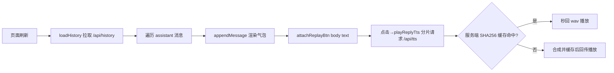

## 用户需求

修复 Web 页面刷新后历史消息无法重听已缓存 TTS 语音的问题。

## 产品概述

Ember Web 页面在刷新后，通过 `/api/history` 加载的历史 Ember 回复消息，目前不会显示语音重播按钮，用户无法重新收听此前已由服务端缓存的 wav 语音，使语音缓存失去意义。

## 核心功能

- 页面刷新、历史消息加载时，为每条历史 Ember 回复气泡下方追加"重播语音"按钮
- 点击历史消息的重播按钮，按换行分片调用 `/api/tts`，命中服务端缓存即秒回播放（未缓存则首次合成后播放，行为与新回复一致）
- 重播逻辑与新回复共用同一套分片顺序播放与打断控制，避免重复实现
- 受语音开关（localStorage `ember-tts`）控制，开关关闭时点击无效（与现有语义一致）

## 技术栈

- 前端：原生 JavaScript（无框架），DOM 操作复用现有 `appendMessage` / `playReplyTts` / `splitTtsSegments` / `stopCurrentTts`
- 后端：无需改动（`/api/tts` 与 wav 缓存已对任意文本正确工作，含历史文本）

## 实现思路

### 关键决策

1. **抽取共用重播按钮创建逻辑**：当前 `sendMessage` 定格处内联创建 `replayBtn` 并绑定 `playReplyTts`。将其抽为函数 `attachReplayBtn(body, text)`，历史加载与新回复都调用，避免逻辑重复、保证行为一致（DRY/KISS）。
2. **历史消息统一挂载重播按钮**：`loadHistory()` 对每条 `role === "assistant"` 的消息，在 `appendMessage` 返回的 `body` 上调用 `attachReplayBtn(body, m.content)`。服务端缓存对前端透明，所有历史 Ember 消息统一入口即可覆盖"重听已缓存语音"需求，且未缓存消息点击也能正常合成。
3. **不改动后端**：服务端 SHA256 缓存键与 `/api/tts` 转发逻辑已验证对历史文本有效（重启后文件持久），无需新增接口。

### 数据流



### 执行细节

- `attachReplayBtn(body, text)`：创建 `button.tts-replay`（文案"🔊 重播语音"），点击调用 `playReplyTts(text, btn)`；追加到 `body` 末尾。文本为完整回复，经 `splitTtsSegments` 清洗后播放，与新回复一致。
- `sendMessage` 定格处：删除内联重播按钮创建代码，改为调用 `attachReplayBtn(body, finalReply)`（并从原处移除 `playReplyTts(finalReply, replayBtn)` 自动朗读调用，因为 `attachReplayBtn` 只挂按钮不自动播放；但当前新回复需要自动朗读，故保留自动朗读调用，仅将按钮创建改为函数调用）。
- 性能：历史最多 50 条，每条仅新增一个 DOM 按钮，开销可忽略；点击后才触发 fetch，无预加载负担。
- 向后兼容：`ttsEnabled` 关闭时 `playReplyTts` 直接 return，按钮点击无副作用，主聊天流程零影响。

## 架构设计

仅前端 `app.js` 修改，逻辑分层不变：历史加载层（`loadHistory`）→ 消息渲染层（`appendMessage`）→ 语音层（`attachReplayBtn`/`playReplyTts`）。无新增跨模块依赖。

## 目录结构

```
G:\Ember\agent\web\
└── resource\javascript\app.js   # [MODIFY] 新增 attachReplayBtn 共用函数；loadHistory 为历史 Ember 消息挂重播按钮；sendMessage 定格处改为调用该函数
```

## 关键代码结构（接口级）

```javascript
/**
 * 在消息气泡 body 下挂重播按钮，点击对整条文本重新分片朗读。
 * @param {HTMLElement} body 消息气泡容器（appendMessage 返回的 body）
 * @param {string} text 完整回复文本
 */
function attachReplayBtn(body, text) {
  const btn = document.createElement("button");
  btn.className = "tts-replay";
  btn.innerHTML = "🔊 重播语音";
  btn.addEventListener("click", () => playReplyTts(text, btn));
  body.appendChild(btn);
}
```

## Agent Extensions

### Skill

- **agent-browser**
- Purpose: 在实现完成后打开 Ember Web 页面，刷新页面加载历史消息，截图确认每条历史 Ember 回复下方均出现"重播语音"按钮；点击某条历史消息的重播按钮，确认能正常播放（命中缓存秒回），验证修复效果。
- Expected outcome: 获得刷新后历史消息重播按钮渲染与点击播放的可视化验证截图，确认语音缓存重听功能恢复。